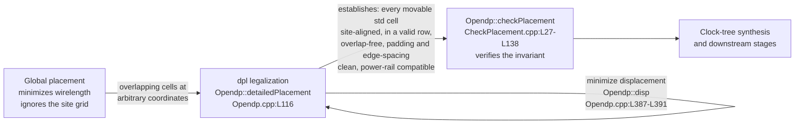
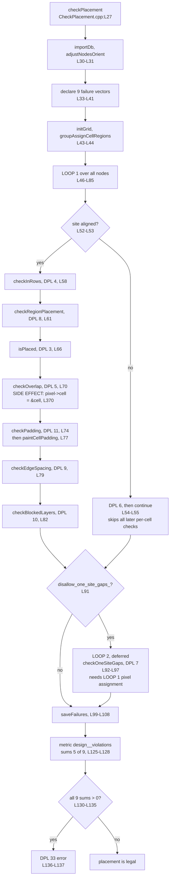
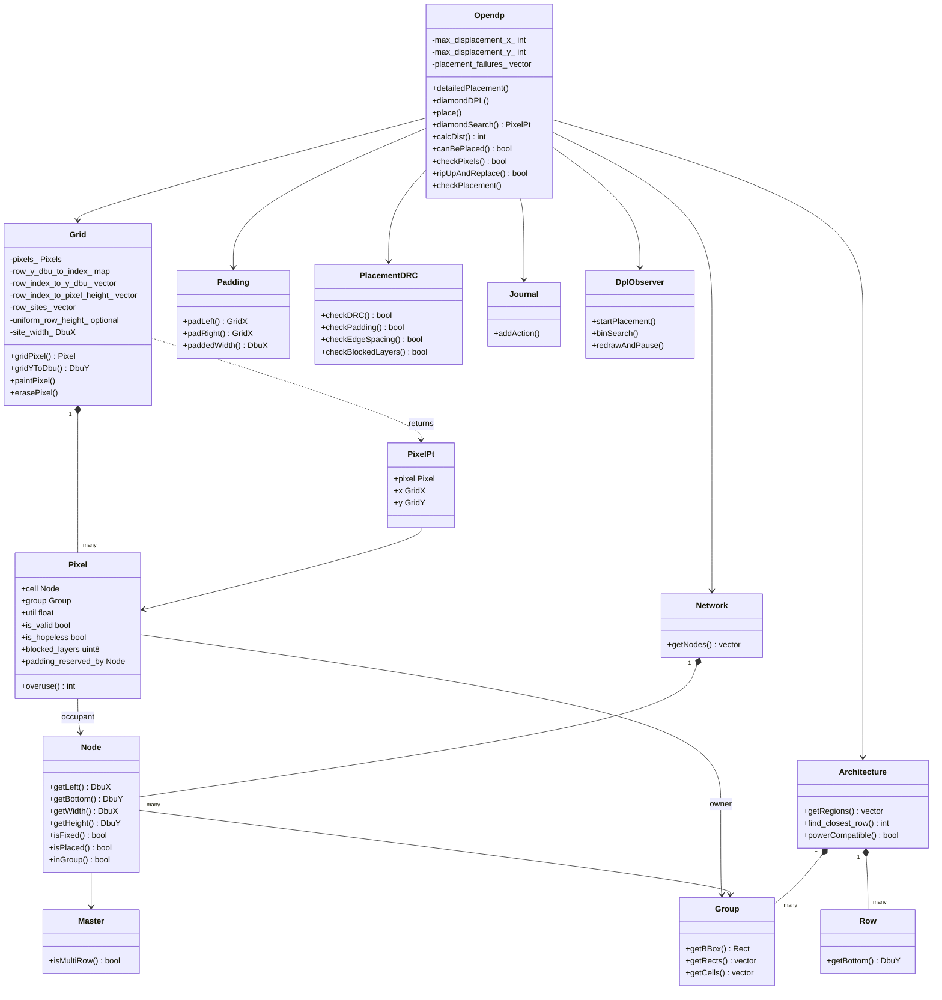
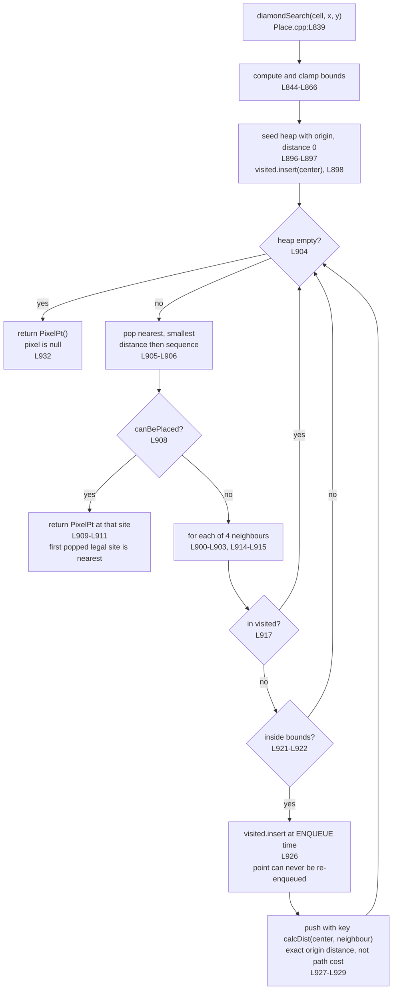
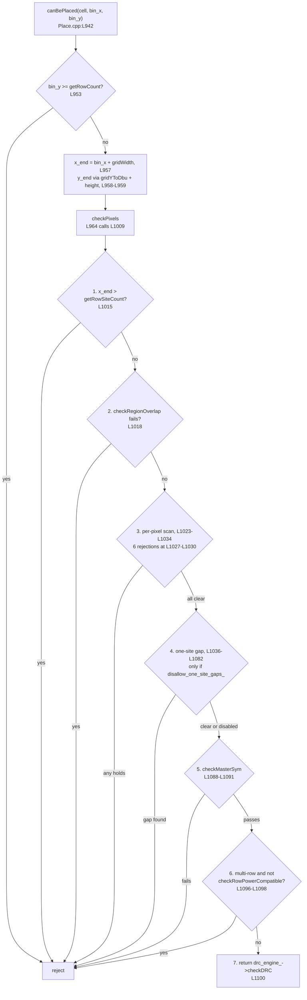
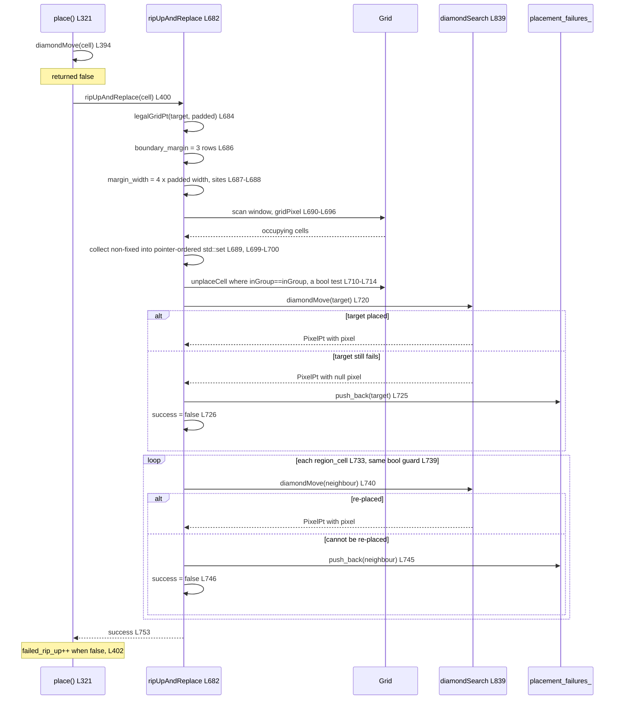
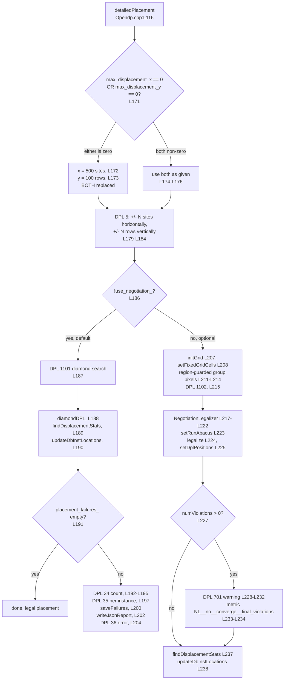
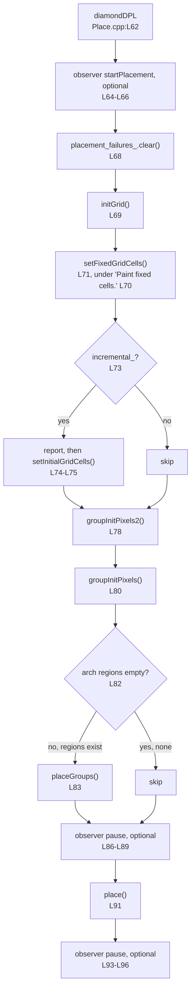

---
myst:
  heading_anchors: 3
---

# Detailed Placement Legalization Algorithm

This document explains how the OpenROAD detailed-placement module (`dpl`)
legalizes a placement: the search that relocates a cell to a legal site, the
exact distance the search minimizes, the order in which cells are processed,
what happens when a cell cannot be placed directly, and the data structures
that make all of it possible.

**Verification pin.** Every `file:line` citation in this document is pinned to
repository commit `4bc0d66972` (full `4bc0d669722a7019bc88a69a025fb2a9f488e35b`).
Line numbers are the numbers at that commit and nowhere else, so a future reader
can measure staleness precisely: resolve any citation with
`git show 4bc0d66972:<path>` and compare it against the current tree. Every
claim below was derived by reading the C++ at that pin, not by restating an
existing description.

Source references are written as an identifier plus a citation — for example
`Opendp::diamondSearch` (`src/dpl/src/Place.cpp:L839-L933`) — rather than as
relative Markdown links, because the documentation build rewrites relative link
prefixes in place (`docs/revert-links.py:L13`, `docs/conf.py:L177`).

**What is cited, and what is not.** Every statement about what the code does
carries a citation to the lines that establish it. A statement that is *derived*
from cited facts — arithmetic, or a consequence of two facts stated above it —
says that it is derived and points at the facts it rests on. The remaining
material carries no citation because it makes no claim about the code: section
transitions, diagram and table captions, vocabulary definitions, and pointers to
other sections of this document.

## Overview

Legalization sits between global placement and clock-tree synthesis. The
repository's reference flow shows the order directly: `global_placement`
(`test/flow.tcl:L61`), then `detailed_placement` (`test/flow.tcl:L90`), then
`clock_tree_synthesis` (`test/flow.tcl:L111`), and `detailed_placement` again
once the clock tree has added buffers (`test/flow.tcl:L119`). Global placement
produces cell positions that minimize wirelength but ignore the discrete site
grid, so cells sit at arbitrary coordinates and overlap each other.

Legalization repairs that: it snaps every movable standard cell onto a legal
site in a legal row, removes all overlap, keeps each cell inside its fence
region, and satisfies the design's padding, edge-spacing and blocked-layer
rules — the exact set of conditions the verifier enforces
(`src/dpl/src/CheckPlacement.cpp:L27-L138`), enumerated in
[The Legality Invariant](#the-legality-invariant). At the moment a cell is
placed the site's orientation (`src/dpl/src/Place.cpp:L1030`) and, for a
multi-row cell, its power-rail parity (`src/dpl/src/Place.cpp:L1096-L1098`) are
enforced as well. All of that is done while **minimally perturbing the global
placement** it was handed, because the wirelength quality of that placement is
the thing being preserved. The module measures how well it did exactly that way:
it reports and publishes total, average and maximum *displacement*, meaning
movement from each cell's original position
(`src/dpl/src/Opendp.cpp:L262-L294`), computed by `Opendp::disp` against the
cell's initial location (`src/dpl/src/Opendp.cpp:L387-L391`).

`Opendp::detailedPlacement` (`src/dpl/src/Opendp.cpp:L116`) is the entry point,
and it selects between **two** legalization engines on a single flag. The
dispatch is `if (!use_negotiation_) {` (`src/dpl/src/Opendp.cpp:L186`):

- **The default engine — diamond search.** It reports `DPL 1101`
  `"Legalizing using diamond search."` (`src/dpl/src/Opendp.cpp:L187`), then
  calls `diamondDPL()` (`src/dpl/src/Opendp.cpp:L188`),
  `findDisplacementStats()` (`src/dpl/src/Opendp.cpp:L189`) and
  `updateDbInstLocations()` (`src/dpl/src/Opendp.cpp:L190`). This is the subject
  of this document.
- **The optional engine — negotiation.** It reports `DPL 1102`
  `"Legalizing using negotiation legalizer."` (`src/dpl/src/Opendp.cpp:L215`)
  and runs a `NegotiationLegalizer` (`src/dpl/src/Opendp.cpp:L217-L225`). It is
  covered here at overview depth only, in
  [The Optional NegotiationLegalizer Engine](#the-optional-negotiationlegalizer-engine).

**What this document covers:** the default diamond-search legalizer — its
legality invariant, data model, cell ordering, site search, distance metric,
recovery path, and known characteristics.

**What it does not cover:** the Tcl command surface — `detailed_placement`
(`src/dpl/src/Opendp.tcl:L4`), `set_placement_padding`
(`src/dpl/src/Opendp.tcl:L63`), `filler_placement`
(`src/dpl/src/Opendp.tcl:L102`), `remove_fillers`
(`src/dpl/src/Opendp.tcl:L118`), `check_placement`
(`src/dpl/src/Opendp.tcl:L129`), `optimize_mirroring`
(`src/dpl/src/Opendp.tcl:L152`) and `improve_placement`
(`src/dpl/src/Opendp.tcl:L165`) — all of which are
documented in the module command reference at
<https://github.com/The-OpenROAD-Project/OpenROAD/blob/master/src/dpl/README.md>.
It also does not cover the detailed-improvement passes held in the
`optimization/`, `objective/` and `util/` subtrees of `src/dpl/src/`, which belong
to a separate lineage. Those are reached through a different command:
`Opendp::improvePlacement` (`src/dpl/src/Optdp.cpp:L52`) is what pulls in
`legalize_shift.h` (`src/dpl/src/Optdp.cpp:L13`) and `optimization/detailed.h` and
`optimization/detailed_manager.h` (`src/dpl/src/Optdp.cpp:L14-L15`), and the
diamond-search legalizer includes none of those three headers
(`src/dpl/src/Place.cpp:L21-L38`).

Three helpers that live in those subtrees *are* on the diamond-search path,
however, and this document does cover them, so the exclusion above should not be
read as a claim that the whole of those trees is unreachable. The legalizer
includes `optimization/detailed_orient.h`, `util/journal.h` and
`util/symmetry.h` (`src/dpl/src/Place.cpp:L35-L37`), and uses
`DetailedOrient::getMasterSymmetry`
(`src/dpl/src/optimization/detailed_orient.cxx:L503`) at
`src/dpl/src/Place.cpp:L1088`, the `Symmetry_X` / `Symmetry_Y` /
`Symmetry_ROT90` bits (`src/dpl/src/util/symmetry.h:L9-L11`) at
`src/dpl/src/Place.cpp:L1120-L1131`, and the `Journal`
(`src/dpl/src/util/journal.h:L91`) to record moves and unplacements.

**D-1 — where legalization sits, and the invariant it establishes.**



## The Legality Invariant

Legality in this module is not an abstract notion; it is exactly the set of
checks that the verifier enforces. `Opendp::checkPlacement`
(`src/dpl/src/CheckPlacement.cpp:L27-L138`) *is* the operational definition, so
reading it is the most reliable way to learn what "legal" means here.

The function begins by rebuilding its view of the design: `importDb();` and
`adjustNodesOrient();` (`src/dpl/src/CheckPlacement.cpp:L30-L31`), then declares
**nine** separate failure vectors, one per check
(`src/dpl/src/CheckPlacement.cpp:L33-L41`). It then re-initializes the grid and
assigns cell regions before testing anything —
`initGrid(); groupAssignCellRegions();`
(`src/dpl/src/CheckPlacement.cpp:L43-L44`) — because both the pixel grid and the
region assignment are inputs to the checks that follow. The set of valid row
coordinates is captured next (`src/dpl/src/CheckPlacement.cpp:L45`).

The per-cell loop runs over the whole network
(`src/dpl/src/CheckPlacement.cpp:L46-L85`) and applies, in source order:

1. **Site alignment**, under the comment `// Site alignment check`
   (`src/dpl/src/CheckPlacement.cpp:L51`). The test is that the cell's left edge
   is an exact multiple of the site width and that its bottom edge is a known
   row coordinate (`src/dpl/src/CheckPlacement.cpp:L52-L53`). This check is
   special: on failure it executes `continue`
   (`src/dpl/src/CheckPlacement.cpp:L55`), so a mis-aligned cell **skips every
   remaining per-cell check**. A single site-alignment failure therefore
   suppresses the other diagnostics for that cell rather than accumulating
   alongside them.
2. **In rows** — `checkInRows` (`src/dpl/src/CheckPlacement.cpp:L58`), applied to
   standard cells only.
3. **Region placement** — `checkRegionPlacement`
   (`src/dpl/src/CheckPlacement.cpp:L61`), also standard-cell only.
4. **Placed**, under `// Placed check`
   (`src/dpl/src/CheckPlacement.cpp:L65`) — `isPlaced`
   (`src/dpl/src/CheckPlacement.cpp:L66`).
5. **Overlap**, under `// Overlap check`
   (`src/dpl/src/CheckPlacement.cpp:L69`) — `checkOverlap`
   (`src/dpl/src/CheckPlacement.cpp:L70`).
6. **Padding**, under `// Padding check`
   (`src/dpl/src/CheckPlacement.cpp:L73`) — `drc_engine_->checkPadding`
   (`src/dpl/src/CheckPlacement.cpp:L74`), after which the cell's padding is
   painted into the grid (`src/dpl/src/CheckPlacement.cpp:L77`).
7. **Edge spacing**, under `// EdgeSpacing check`
   (`src/dpl/src/CheckPlacement.cpp:L78`) — `drc_engine_->checkEdgeSpacing`
   (`src/dpl/src/CheckPlacement.cpp:L79`).
8. **Blocked layers** — `drc_engine_->checkBlockedLayers`
   (`src/dpl/src/CheckPlacement.cpp:L82`).

The ninth check runs in a **second, separate loop**
(`src/dpl/src/CheckPlacement.cpp:L92-L97`, gated on `disallow_one_site_gaps_` at
`src/dpl/src/CheckPlacement.cpp:L91`, with `// One site gap check` at
`src/dpl/src/CheckPlacement.cpp:L93`). The deferral is deliberate and the code
explains it in five lines (`src/dpl/src/CheckPlacement.cpp:L86-L90`): the loop is
separate because it must run after the overlap check, since the overlap check
assigns the overlap cell to its pixel, and otherwise the gap check would see
those pixels as null and miss the violations they would have produced.

The causality is worth spelling out, because it is invisible from the gap check
itself. `Opendp::checkOverlap` (`src/dpl/src/CheckPlacement.cpp:L358`) does more
than report; when it walks a cell's pixels and finds one unoccupied, it **writes
the cell into that pixel** — `pixel->cell = &cell;`
(`src/dpl/src/CheckPlacement.cpp:L370`). Occupancy information therefore does not
exist until the overlap pass has visited every cell. `Opendp::checkOneSiteGaps`
(`src/dpl/src/CheckPlacement.cpp:L391`) probes the pixels beside a cell to decide
whether a one-site hole was left, so running it in the first loop would test a
grid that is still being populated. The second loop is the fix for an ordering
dependency, not a stylistic choice.

Failures are then persisted with `saveFailures`
(`src/dpl/src/CheckPlacement.cpp:L99-L108`) and optionally serialized with
`writeJsonReport` (`src/dpl/src/CheckPlacement.cpp:L109-L111`).

### The Nine Reported Checks

**TABLE 1.** The nine identifiers, exactly as reported at
`src/dpl/src/CheckPlacement.cpp:L112-L124`. Note that they are **not emitted in
ascending numeric order**: identifier 11 is emitted between 5 and 6.

| DPL id | Check | Reported at |
|---|---|---|
| 3 | Placed | `CheckPlacement.cpp:L112` |
| 4 | Placed in rows | `CheckPlacement.cpp:L113` |
| 5 | Overlap | `CheckPlacement.cpp:L114-L117` (with the `reportOverlapFailure` callback at `L116`) |
| 11 | Padding | `CheckPlacement.cpp:L118` |
| 6 | Site aligned | `CheckPlacement.cpp:L119` |
| 7 | One site gap | `CheckPlacement.cpp:L120` |
| 8 | Region placement | `CheckPlacement.cpp:L121` |
| 9 | LEF58_CELLEDGESPACINGTABLE | `CheckPlacement.cpp:L122-L123` |
| 10 | Blocked layers | `CheckPlacement.cpp:L124` |

Two aggregations follow (`src/dpl/src/CheckPlacement.cpp:L125-L128` and
`src/dpl/src/CheckPlacement.cpp:L130-L138`), and they do **not** cover the same
ground:

- The published `design__violations` metric
  (`src/dpl/src/CheckPlacement.cpp:L125-L128`) sums only **five of the nine**
  vectors: placed, in-rows, overlap, padding and site-aligned. Region placement,
  one-site gap, edge spacing and blocked layers are excluded from the metric.
- The terminal aggregation (`src/dpl/src/CheckPlacement.cpp:L130-L138`) sums
  **all nine**, with the one-site-gap term included conditionally on
  `disallow_one_site_gaps_` (`src/dpl/src/CheckPlacement.cpp:L132`). If that
  total is non-zero it raises `DPL 33`
  `"detailed placement checks failed during check placement."`
  (`src/dpl/src/CheckPlacement.cpp:L136-L137`).

That difference has a consequence, derived from the two citations above: a design
can fail `check_placement` with `DPL 33` while `design__violations` reports zero —
for instance on an edge-spacing or blocked-layer failure alone, because neither
vector is one of the five the metric sums
(`src/dpl/src/CheckPlacement.cpp:L125-L128`) although both are counted by the
terminal total, which sums all nine
(`src/dpl/src/CheckPlacement.cpp:L130-L138`).

The check implementations are `checkInRows`
(`src/dpl/src/CheckPlacement.cpp:L325`), `checkOverlap`
(`src/dpl/src/CheckPlacement.cpp:L358`, with its header comment at
`L357`), `overlap` (`src/dpl/src/CheckPlacement.cpp:L376`), `checkOneSiteGaps`
(`src/dpl/src/CheckPlacement.cpp:L391`), `checkRegionPlacement`
(`src/dpl/src/CheckPlacement.cpp:L423`) and `isPlaced`
(`src/dpl/src/CheckPlacement.cpp:L320`); the reporting side is `saveViolations`
(`src/dpl/src/CheckPlacement.cpp:L141`), `saveFailures`
(`src/dpl/src/CheckPlacement.cpp:L187`), `writeJsonReport`
(`src/dpl/src/CheckPlacement.cpp:L274`), the two `reportFailures` overloads
(`src/dpl/src/CheckPlacement.cpp:L282` and `L292`) and `reportOverlapFailure`
(`src/dpl/src/CheckPlacement.cpp:L309`).

**D-7 — the verification sequence, with the deferred second loop.**



## Key Data Structures

Three structures carry the search: the **site grid** of pixels
(`src/dpl/src/infrastructure/Grid.h:L42-L59`), the **row** lookup tables
(`src/dpl/src/infrastructure/Grid.h:L216-L228`), and the search **frontier**
(`src/dpl/src/Place.cpp:L880-L893`). Two more are indispensable and are covered
here as well: the strongly-typed coordinate wrappers that keep grid indices and
database units apart (`src/dpl/src/infrastructure/Coordinates.h:L195-L228`), and
the supporting objects the placer consults while testing legality.

Vocabulary, introduced once and used consistently from here on: a **site** is the
horizontal unit of the grid and a **row** the vertical one; a **database unit**
(DBU) is the unit of physical distance in the design database; a **pixel** is one
cell of the grid; the **frontier** is the search's priority queue;
**legalization** is the operation and **displacement** is movement from a cell's
original position.

### The Site Grid

The grid is a two-dimensional array of `Pixel`
(`src/dpl/src/infrastructure/Grid.h:L42-L59`). Its own class documentation states
the design in the authors' words (`src/dpl/src/infrastructure/Grid.h:L72-L75`):
the "Grid" is a 2D array of pixels, the pixels represent the single-height sites
onto which multi-height sites are overlaid, and the sites are assumed to be of a
single width but the **rows are of variable height in order to support hybrid
rows**. `class Grid` itself begins at `src/dpl/src/infrastructure/Grid.h:L76`.

Each pixel carries the following state
(`src/dpl/src/infrastructure/Grid.h:L44-L58`):

| Field | Line | Meaning |
|---|---|---|
| `Node* cell` | `Grid.h:L44` | the cell currently occupying this pixel, or null |
| `Group* group` | `Grid.h:L45` | the fence region that owns this pixel, or null |
| `float util` | `Grid.h:L46` | utilization contribution |
| `bool is_valid` | `Grid.h:L47` | annotated in source as `false for dummy cells`; a real site exists here |
| `bool is_hopeless` | `Grid.h:L48` | annotated in source as `too far from sites for diamond search` |
| `uint8_t blocked_layers` | `Grid.h:L49` | routing layers blocked at this pixel |
| `Node* padding_reserved_by` | `Grid.h:L51` | under the comment `// Cell that reserved this pixel for padding` at `L50` |
| `int capacity` | `Grid.h:L54` | negotiation-engine data, annotated `1 if site exists, 0 if blockage` |
| `int usage` | `Grid.h:L55` | negotiation-engine occupancy count |
| `double hist_cost` | `Grid.h:L56` | negotiation-engine history cost |
| `overuse()` | `Grid.h:L58` | `std::max(usage - capacity, 0)`, used only by the negotiation engine |

The last four fields are grouped in source under `// Hybrid negotiation data`
(`src/dpl/src/infrastructure/Grid.h:L53`) and are not consulted by the
diamond-search path.

A grid search returns a pixel-plus-coordinates triple rather than a bare pointer.
Under the comment `// Return value for grid searches.`
(`src/dpl/src/infrastructure/Grid.h:L61`), `class PixelPt`
(`src/dpl/src/infrastructure/Grid.h:L62-L70`) holds `Pixel* pixel = nullptr;`
(`L67`), `GridX x{0};` (`L68`) and `GridY y{0};` (`L69`), with a defaulted
constructor at `L65` and a three-argument constructor at `L66`. The defaulted
form is what "no site found" looks like: a `PixelPt` whose `pixel` is null.

### Rows and the Variable-Height Row Table

Rows may differ in height — the `Grid` class comment states that sites are
assumed to be of a single width but that the rows are of variable height in order
to support hybrid rows (`src/dpl/src/infrastructure/Grid.h:L72-L75`) — so the
vertical axis is resolved by lookup rather than by multiplication. `Grid`
therefore keeps **four** lookup tables, introduced by an
explanatory comment stating that the first contains all the rows' `yLo` plus the
`yHi` of the last row, the extra value being useful for operations like region
snapping to rows (`src/dpl/src/infrastructure/Grid.h:L216-L217`):

| Table | Line | Direction |
|---|---|---|
| `std::map<DbuY, GridY> row_y_dbu_to_index_` | `Grid.h:L218` | database-unit coordinate to row index |
| `std::vector<DbuY> row_index_to_y_dbu_` | `Grid.h:L219` | row index to database-unit coordinate (annotated `index is GridY`) |
| `std::vector<DbuY> row_index_to_pixel_height_` | `Grid.h:L220` | row index to that row's height (annotated `index is GridY`) |
| `std::vector<RowSitesMap> row_sites_` | `Grid.h:L223` | an interval map of the valid site spans in each row, under `// Indexed by row (GridY)` at `L222` |

Related state completes the picture: `has_hybrid_rows_`
(`src/dpl/src/infrastructure/Grid.h:L225`), `core_`
(`src/dpl/src/infrastructure/Grid.h:L226`), `site_width_`
(`src/dpl/src/infrastructure/Grid.h:L229`), `row_count_`
(`src/dpl/src/infrastructure/Grid.h:L231`) and `row_site_count_`
(`src/dpl/src/infrastructure/Grid.h:L232`).

Two of those fields are easy to conflate, and the implementation derives them
independently of each other — in two separate passes over the rows
(`src/dpl/src/infrastructure/Grid.cpp:L706-L710` and
`src/dpl/src/infrastructure/Grid.cpp:L744-L767`).

`bool has_hybrid_rows_` (`src/dpl/src/infrastructure/Grid.h:L225`) is set from
the site's own flag while the rows are walked — `if (site->isHybrid())`
(`src/dpl/src/infrastructure/Grid.cpp:L706-L708`), with a local variable
tracking the converse case (`src/dpl/src/infrastructure/Grid.cpp:L709-L710`) —
and the pair is consulted only to raise `DPL 12` `"no rows found."` when neither
kind of row was seen (`src/dpl/src/infrastructure/Grid.cpp:L732-L734`).

`std::optional<DbuY> uniform_row_height_;`
(`src/dpl/src/infrastructure/Grid.h:L228`) is computed in a **separate** pass
over the rows, later in the same function
(`src/dpl/src/infrastructure/Grid.cpp:L744-L767`). It is reset first
(`src/dpl/src/infrastructure/Grid.cpp:L744`), seeded with the first row's site
height (`src/dpl/src/infrastructure/Grid.cpp:L764-L766`), and thereafter
retained only while the larger of the running value and the next site height is
an exact multiple of the smaller: `if (larger % smaller != 0)` resets it and
stops the scan, and otherwise the running value becomes the smaller of the two
(`src/dpl/src/infrastructure/Grid.cpp:L751-L766`). What clears the optional is
therefore a height that is **not** an integer multiple — not hybridness as such.
A design with hybrid rows whose site heights are integer multiples of one
another still holds a value here. `Grid::isMultiHeight`
(`src/dpl/src/infrastructure/Grid.cpp:L781-L788`) treats the two the same way:
it compares a master against `uniform_row_height_` whenever the optional holds a
value and falls back to the site's row pattern only when it does not. The
field's trailing comment reads `// unset if hybrid`
(`src/dpl/src/infrastructure/Grid.h:L228`), which is narrower than what the code
does; that is recorded as observation **O1** in
[Known Gotchas, Determinism, and Limitations](#known-gotchas-determinism-and-limitations).

Independently of any of that, the vertical axis of the search's distance is
always resolved through a table rather than computed from a constant, because
`Grid::gridYToDbu` (`src/dpl/src/infrastructure/Grid.cpp:L664-L670`) consults
the coordinate table unconditionally: `return row_index_to_y_dbu_.at(y.v);`
(`src/dpl/src/infrastructure/Grid.cpp:L669`), and falls back to the core's top
edge at the one-past-the-end sentinel index —
`if (y == row_index_to_y_dbu_.size()) {`
(`src/dpl/src/infrastructure/Grid.cpp:L666`) returning `DbuY{core_.yMax()}`
(`src/dpl/src/infrastructure/Grid.cpp:L667`). The sentinel is what makes the
extra `yHi` entry described at `Grid.h:L216-L217` usable as an exclusive upper
bound.

`Grid::examineRows` (`src/dpl/src/infrastructure/Grid.cpp:L697`) is what
populates these tables from the database, `Grid::rowHeight`
(`src/dpl/src/infrastructure/Grid.cpp:L790`) reads a single row's height back,
and `Grid::getRowCoordinates` (`src/dpl/src/infrastructure/Grid.cpp:L772`)
produces the coordinate set that the site-alignment check consumes at
`src/dpl/src/CheckPlacement.cpp:L45`.

### Strongly-Typed Coordinates

Grid indices and database units are different types, not different variables of
the same type. `struct TypedCoordinate`
(`src/dpl/src/infrastructure/Coordinates.h:L26-L38`) is the wrapper the aliases are
built from, and its header comment says why multiplication and division are
deliberately left undefined on it: those operations are often used to convert
between database units and pixels, and such conversions must be explicit about the
resulting type (`src/dpl/src/infrastructure/Coordinates.h:L20-L24`). Only explicit
helpers convert between the two spaces
(`src/dpl/src/infrastructure/Coordinates.h:L195-L223`):

- `gridToDbu(GridX x, DbuX scale)` returns `DbuX{x.v * scale.v}`
  (`src/dpl/src/infrastructure/Coordinates.h:L195-L198`), with the `GridY`
  overload immediately after
  (`src/dpl/src/infrastructure/Coordinates.h:L200-L203`).
- `dbuToGridCeil` and `dbuToGridFloor` provide the reverse direction for both
  axes (`src/dpl/src/infrastructure/Coordinates.h:L205-L223`).
- `sumXY(DbuX x, DbuY y)` returns `x.v + y.v`
  (`src/dpl/src/infrastructure/Coordinates.h:L225-L228`) — the only sanctioned
  way to add an X component to a Y component, and its parameter types require both
  arguments to already be in database units.

This matters more here than it would elsewhere, because the search's distance
function mixes both spaces inside a single expression: `Opendp::calcDist`
(`src/dpl/src/Place.cpp:L935-L940`, the mixing itself at
`src/dpl/src/Place.cpp:L937-L939`) starts from grid indices and must finish in
database units. The type system is what forces the conversion to be written out
rather than assumed — `sumXY` accepts only `DbuX` and `DbuY`
(`src/dpl/src/infrastructure/Coordinates.h:L225-L228`).

The wrappers also make the closed set possible. Under
`// Enable use with unordered_map/set`
(`src/dpl/src/infrastructure/Coordinates.h:L232`) there is a generic hash for any
`TypedCoordinate` (`src/dpl/src/infrastructure/Coordinates.h:L235-L242`) and an
explicit `hash<dpl::GridPt>` specialization
(`src/dpl/src/infrastructure/Coordinates.h:L244-L253`) whose `operator()`
combines the two component hashes with
`return hashX ^ (hashY + 0x9e3779b9 + (hashX << 6) + (hashX >> 2));`
(`src/dpl/src/infrastructure/Coordinates.h:L251`). Without that specialization
the frontier's `std::unordered_set<GridPt>` could not be instantiated.

### The Search Frontier

The frontier is three collaborating objects, all declared inside
`Opendp::diamondSearch` (`src/dpl/src/Place.cpp:L880-L893`):

1. **The entry type** — a local `struct PQ_entry`
   (`src/dpl/src/Place.cpp:L880-L890`) carrying a distance, a grid point and a
   sequence number.
2. **The queue** — a `std::priority_queue` over a `std::vector` with
   `std::greater`, therefore a min-heap (`src/dpl/src/Place.cpp:L891-L892`).
3. **The closed set** — a `std::unordered_set<GridPt> visited;`
   (`src/dpl/src/Place.cpp:L893`).

Their mechanics, and why each is shaped the way it is, are in
[Frontier and Closed Set](#frontier-and-closed-set).

### Supporting Objects

The placer consults several other objects while deciding whether a site is legal
and while recording what it did; they are its own members
(`src/dpl/include/dpl/Opendp.h:L362-L366`, with `grid_` at
`src/dpl/include/dpl/Opendp.h:L374` and `debug_observer_` at
`src/dpl/include/dpl/Opendp.h:L394`):

- **Nodes, groups and masters** — `src/dpl/src/infrastructure/Objects.h` declares
  `MasterEdge` (`L18`), `Master` (`L30`), `Node` (`L59`), `Group` (`L171`),
  `Edge` (`L198`) and `Pin` (`L214`). A `Node` is a placeable object; a `Group`
  is a fence region with the cells assigned to it.
- **Padding** — `src/dpl/src/infrastructure/Padding.h` declares `Padding`
  (`L15`) with `padLeft` (`L27-L28`), `padRight` (`L29-L30`) and `paddedWidth`
  (`L32`). Padded width, not raw width, is what sets the horizontal extent of the
  rip-up window described in
  [Fallback and Recovery](#fallback-and-recovery).
- **Architecture, rows and regions** — `src/dpl/src/infrastructure/architecture.h`
  declares `Architecture` (`L22`) with the nested `Architecture::Row` (`L27`,
  defined at `L98`), `getRegions` (`L36`), `find_closest_row` (`L47`) and
  `powerCompatible` (`L62`). The last two are what the power-rail parity stage of
  the legality predicate calls.
- **Network** — `src/dpl/src/infrastructure/network.h` declares `Network`
  (`L32`) and exposes the node container through `getNodes` (`L35`). The **order**
  of that container is the foundation of the module's determinism, as
  [The Determinism Foundation](#the-determinism-foundation) explains.
- **Design-rule engine** — `src/dpl/src/PlacementDRC.h` declares the interface
  invoked as the final stage of the legality predicate, and the same engine
  supplies the padding, edge-spacing and blocked-layer checks used by the
  verifier (`src/dpl/src/CheckPlacement.cpp:L74`,
  `src/dpl/src/CheckPlacement.cpp:L79`, `src/dpl/src/CheckPlacement.cpp:L82`).
- **Journal** — `src/dpl/src/util/journal.h` declares `JournalActionTypeEnum`
  (`L17`), `JournalAction` (`L22`), `MoveCellAction` (`L28`),
  `UnplaceCellAction` (`L73`) and `Journal` (`L91`). These are the records that
  make the rip-up path reversible: `Opendp::placeCell` appends a
  `MoveCellAction` (`src/dpl/src/Place.cpp:L1430-L1438`) and
  `Opendp::unplaceCell` appends an `UnplaceCellAction`
  (`src/dpl/src/Place.cpp:L1446-L1449`), each only when a journal has been
  installed via `Opendp::setJournal` (`src/dpl/src/Opendp.cpp:L106`).
- **Debug observer** — `src/dpl/src/graphics/DplObserver.h` declares
  `DplObserver` (`L30`) with `startPlacement` (`L35`), `drawSelected` (`L36`),
  `binSearch` (`L37`) and `redrawAndPause` (`L43`). Every call site is guarded on
  the observer being non-null, so the engine is headless by default.

**D-8 — the data model.**



## Cell Ordering

Cells are legalized one at a time — the general pass walks its sorted vector and
places one cell per iteration, `for (Node* cell : sorted_cells) {`
(`src/dpl/src/Place.cpp:L384-L404`) — and every committed cell paints the pixels
it occupies, `grid_->paintPixel(cell);` (`src/dpl/src/Place.cpp:L1426`, inside
`Opendp::placeCell` at `src/dpl/src/Place.cpp:L1420-L1439`), so each cell is
placed into a grid that already holds every cell placed before it.
Order therefore changes the result, and a legalizer that wants reproducible output
needs an order that is both deliberate and total. `dpl` gets both from one
comparator.

### CellPlaceOrderLess: Four Sort Keys

`CellPlaceOrderLess` (`src/dpl/src/Place.cpp:L271-L283`) declares a constructor
(`src/dpl/src/Place.cpp:L274`), the comparison operator
(`src/dpl/src/Place.cpp:L275`), a private `centerDist` helper
(`src/dpl/src/Place.cpp:L278`), and three members: `const int center_x_`
(`src/dpl/src/Place.cpp:L280`), `const int center_y_`
(`src/dpl/src/Place.cpp:L281`) and `const Opendp* opendp_`
(`src/dpl/src/Place.cpp:L282`).

The constructor (`src/dpl/src/Place.cpp:L285-L291`) computes and stores the
**core centre** once, as
`center_x_((core.xMin() + core.xMax()) / 2)` (`src/dpl/src/Place.cpp:L287`) and
`center_y_((core.yMin() + core.yMax()) / 2)` (`src/dpl/src/Place.cpp:L288`), so
the third key costs nothing per comparison beyond two subtractions.

`CellPlaceOrderLess::centerDist` (`src/dpl/src/Place.cpp:L293-L297`) is
`sumXY(abs(cell->getLeft() - center_x_), abs(cell->getBottom() - center_y_))`.
Two properties must be stated precisely, because both differ from the search's
distance:

- It is **unweighted**. Neither axis is scaled; a database unit of vertical
  offset counts exactly as much as a database unit of horizontal offset
  (`src/dpl/src/Place.cpp:L295-L296`, whose `sumXY`
  — `src/dpl/src/infrastructure/Coordinates.h:L225-L228` — adds the two absolute
  differences with no scale factor applied to either, to be contrasted with the
  site-width and row-table scaling at `src/dpl/src/Place.cpp:L937-L938`).
- It measures from the cell's **lower-left corner** — `cell->getLeft()`
  (`src/dpl/src/infrastructure/Objects.cpp:L104`) and `cell->getBottom()`
  (`src/dpl/src/infrastructure/Objects.cpp:L108`), used at
  `src/dpl/src/Place.cpp:L295-L296` — not from the cell's centre, and it measures
  to the core centre the constructor stored
  (`src/dpl/src/Place.cpp:L287-L288`).

**TABLE 2.** The four keys, in the order `operator()`
(`src/dpl/src/Place.cpp:L299-L319`) evaluates them. `isMultiRow` is queried once
per operand up front (`src/dpl/src/Place.cpp:L301-L302`).

| # | Key | Direction | Evaluated at |
|---|---|---|---|
| 1 | multi-row versus single-row | multi-row first | `Place.cpp:L304-L306` — `if (is_multi_row1 != is_multi_row2) { return is_multi_row1; }` |
| 2 | cell area | larger first | `Place.cpp:L312` — `area1 > area2` |
| 3 | `centerDist` to the core centre | smaller first | `Place.cpp:L314` — `dist1 < dist2` |
| 4 | instance name | ascending | `Place.cpp:L316-L318` — `strcmp` on `getConstName()` |

The chain is written in two parts. Key 1 stands apart from the other three: it is
an early return (`src/dpl/src/Place.cpp:L304-L306`) taken before area, distance or
name is computed at all — those three are read only afterwards
(`src/dpl/src/Place.cpp:L308-L311`) — so a multi-row cell outranks every
single-row cell regardless of how the remaining keys would have compared.

```cpp
if (is_multi_row1 != is_multi_row2) {
  return is_multi_row1;
}
```

— `src/dpl/src/Place.cpp:L304-L306`. Returning `is_multi_row1` directly is what
puts multi-row cells first: the branch is reached only when the two operands
disagree, so `is_multi_row1` is `true` exactly when the first operand is the
multi-row one, and `operator()` answers "cell1 sorts before cell2".

Keys 2, 3 and 4 are then one nested expression
(`src/dpl/src/Place.cpp:L312-L318`), so each is consulted only on exact equality
of the key above it.

```cpp
return area1 > area2
       || (area1 == area2
           && (dist1 < dist2 || (dist1 == dist2 && strcmp(...) < 0)));
```

— `src/dpl/src/Place.cpp:L312-L318` (the `strcmp` arguments elided here are the
two instances' `getConstName()` values at `L316-L317`).

Between them the two fragments carry all four keys of TABLE 2, in the order
`operator()` (`src/dpl/src/Place.cpp:L299-L319`) evaluates them.

The comparator needs the placer to answer the row-span question, so it is
declared a friend: `friend class CellPlaceOrderLess;`
(`src/dpl/include/dpl/Opendp.h:L196`), and `Opendp::isMultiRow`
(`src/dpl/src/Opendp.cpp:L46-L49`) forwards to the network's master record. The
comparator is applied at **two** sites — the general pass
(`src/dpl/src/Place.cpp:L381`) and the grouped-cell pass
(`src/dpl/src/Place.cpp:L449`) — so grouped and ungrouped cells are ordered by
identical rules.

### Why This Order

Each key exists for a reason that the code itself does not state.

- **Multi-row cells first.** A multi-row cell must find a vertical run of rows
  whose power-rail parity matches its own pin stack, and the legality predicate
  enforces exactly that with a dedicated stage
  (`src/dpl/src/Place.cpp:L1096-L1098`). It is therefore the most constrained
  kind of cell in the design, and the constraint gets harder to satisfy as
  neighbours are committed. Placing these first spends the grid's freedom where
  freedom is scarcest.
- **Larger area next.** The same argument by degree: a wide cell needs a longer
  uninterrupted run of free, valid, same-group pixels, and the per-pixel scan
  rejects the whole candidate if any single pixel in the run fails
  (`src/dpl/src/Place.cpp:L1023-L1034`). Large cells are the ones that stop
  fitting once the row is fragmented, so they go first.
- **Closer to the core centre next.** The same scarcity argument applied to
  position rather than size: the interior is the most contended region of the
  grid, so claiming it early spares later cells a long walk outwards. What makes
  it contended is that the grid is claimed first come, first served — every
  committed cell paints its pixels (`src/dpl/src/Place.cpp:L1426`) and the
  per-pixel scan rejects any candidate that overlaps an already-painted pixel
  (`src/dpl/src/Place.cpp:L1027`) — and a cell denied a site near its starting
  point has to keep expanding the frontier outwards to find one
  (`src/dpl/src/Place.cpp:L927-L929`), at a cost measured by
  `Opendp::calcDist` (`src/dpl/src/Place.cpp:L935-L940`).

  The search's *reach* runs the other way, and it is worth separating the two
  effects. Under `// Clip limits to grid bounds.`
  (`src/dpl/src/Place.cpp:L862`) the window is truncated to the grid —
  `x_min = max(GridX{0}, x_min);` and the three companion clamps
  (`src/dpl/src/Place.cpp:L863-L866`) — so it is cells near the **periphery**,
  not cells near the centre, whose search window is the one that gets cut short.
  This key is about contention, not about reach.
- **Instance name last** (`src/dpl/src/Place.cpp:L316-L318`). This key never breaks
  a tie between meaningfully different cells — by the time it is reached the two
  cells have identical row-span class, identical area and identical distance to the
  core centre. Its purpose is not to choose well; it is to choose *the same way
  every time*. An instance name identifies one instance within a block — the
  database looks instances up by it and returns a single object,
  `dbInst* findInst(const char* name);`
  (`src/odb/include/odb/db.h:L779`, documented at `L775-L778`) — so no two
  distinct cells can tie on it, and the comparator is a **strict total order**
  rather than merely a weak ordering.

  That guarantee belongs to this comparator and to the two sorts that use it
  (`src/dpl/src/Place.cpp:L381` and `src/dpl/src/Place.cpp:L449`). It does not
  extend to the module's other sorts; [Secondary Orderings](#secondary-orderings)
  gives the full inventory and identifies the three that can tie.

### The Determinism Foundation

Reproducibility is not an aspiration here, it is a checked requirement of the
repository: the regression harness compares each test's log against a stored
golden with an exact `diff` and fails the test on any difference
(`test/regression.tcl:L208`), using the default option set `set diff_options "-c"`
(`test/regression_vars.tcl:L39`). `dpl` alone ships 83 `.ok` log goldens and 62
`.defok` DEF goldens under `src/dpl/test`, and the DEF goldens pin the actual
placed coordinates, so any change in the order cells are legalized in shows up as
a test failure rather than as an equally acceptable alternative result. The build
carries the same intent down to the arithmetic, pinning `-ffp-contract=off`
repository-wide (`.bazelrc:L32-L34` and `src/CMakeLists.txt:L174-L176`).

In a legalizer, ordering *is* determinism: two runs that process cells in
different sequences produce different, though equally legal, placements. That
follows from the two facts this section opened with — each cell is placed into a
grid already holding every cell placed before it
(`src/dpl/src/Place.cpp:L384-L404` and `src/dpl/src/Place.cpp:L1426`), and an
occupied pixel rejects a candidate outright
(`src/dpl/src/Place.cpp:L1027`). The default path earns its reproducibility in
three layers — the first of them the non-stable sort at
`src/dpl/src/Place.cpp:L381` — and the bottom layer is easy to miss.

**Layer 1 — the sort is not stable.** The general pass sorts with
`std::ranges::sort(sorted_cells, CellPlaceOrderLess(core_, this));`
(`src/dpl/src/Place.cpp:L381`), and `std::ranges::sort` gives no guarantee about
the relative order of elements the comparator calls equivalent. Nothing about the
sort call preserves input order.

**Layer 2 — so the comparator must be total, and the name key is what makes it
total.** Because the sort discards input order for equivalent elements, the only
way to get a unique output permutation is for the comparator to declare no two
distinct cells equivalent. That is the entire job of the `strcmp` on instance
names (`src/dpl/src/Place.cpp:L316-L318`), and it is what scopes the guarantee:
what follows applies to the two sorts that use `CellPlaceOrderLess`
(`src/dpl/src/Place.cpp:L381` and `src/dpl/src/Place.cpp:L449`) and not to the
secondary sorts, whose comparators can tie — see
[Secondary Orderings](#secondary-orderings). Remove that key and the first three
would leave genuine ties — same row-span class, same area, same centre distance
is common in a design built from a standard cell library — and the resulting
order would be whatever the sort implementation happened to produce.

**Layer 3 — and the input order itself is name-ordered, stably, before any of
this runs.** When the network is built, `Opendp::createNetwork`
(`src/dpl/src/dbToOpendp.cpp:L244`) copies the block's instances into a vector
(`src/dpl/src/dbToOpendp.cpp:L257-L258`) and sorts them by name:

```cpp
std::ranges::stable_sort(
    insts, [](dbInst* a, dbInst* b) { return a->getName() < b->getName(); });
```

— `src/dpl/src/dbToOpendp.cpp:L259-L260`. The consuming loop that creates nodes
then walks that sorted vector (`src/dpl/src/dbToOpendp.cpp:L262`), skipping
instances that are not placeable under
`// Skip instances which are not placeable.`
(`src/dpl/src/dbToOpendp.cpp:L263-L264`).

**Why layer 3 exists:** the database's own instance iteration order is an
implementation detail of the database, and it is not guaranteed to be the same
across builds, platforms or even across designs that differ only in how they were
loaded. Sorting by name once, at network construction, makes the node container's
order a pure function of the design's names. Every downstream traversal **of that
container** inherits the order: the eligibility scan at
`src/dpl/src/Place.cpp:L366-L380`, `Opendp::prePlace`
(`src/dpl/src/Place.cpp:L125`), `Opendp::refine`
(`src/dpl/src/Place.cpp:L607`), and the verifier's loops at
`src/dpl/src/CheckPlacement.cpp:L46` and `src/dpl/src/CheckPlacement.cpp:L92`.
This is the foundation the other two layers stand on.

The guarantee is a property of that container and of nothing else. Passes that
reach their cells through a fence region instead — `Opendp::prePlaceGroups`
(`src/dpl/src/Place.cpp:L209`), `Opendp::placeGroups2`
(`src/dpl/src/Place.cpp:L444`), and the three group-local sorts — iterate
`group->getCells()`, whose order comes from elsewhere and is inventoried in the
subsection on secondary orderings below. `placeGroups2` is unaffected because
it re-sorts with the total `CellPlaceOrderLess` comparator
(`src/dpl/src/Place.cpp:L449`) before using the result.

Rows are given comparable treatment during architecture post-processing, but by
**two** sorts rather than one, and it is the second that fixes the row indices
everything else uses.

The first, under `// Sort rows.`
(`src/dpl/src/infrastructure/architecture.cxx:L114`), is
`std::ranges::stable_sort(rows_, std::less{}, &Architecture::Row::getBottom);`
(`src/dpl/src/infrastructure/architecture.cxx:L115`). It runs **before** rows are
merged, and its purpose is precisely to make co-linear rows adjacent so the scan
that follows can find them — dealing with co-linear rows is part of what
`Architecture::postProcess` exists for, as its own opening comment says
(`src/dpl/src/infrastructure/architecture.cxx:L102-L107`). So the bottom
coordinate is **not** a unique key here: a design with fragmented rows is exactly
one in which several `Row` objects share a bottom, and the scan groups every such
run into a sub-row set:

```cpp
while (r < rows_.size()
       && abs(rows_[r]->getBottom() - subrows[0]->getBottom()) == 0) {
```

— `src/dpl/src/infrastructure/architecture.cxx:L132-L133`. At this stage it is the
choice of `stable_sort` rather than key uniqueness that makes the result
reproducible: rows sharing a bottom keep the relative order they arrived in.

Each sub-row set is then collapsed into a single row spanning the union of its
intervals, with the surplus `Row` objects deleted
(`src/dpl/src/infrastructure/architecture.cxx:L171-L184`), and gaps between the
intervals become filler nodes
(`src/dpl/src/infrastructure/architecture.cxx:L186-L208`). The merged vector
replaces the original at `src/dpl/src/infrastructure/architecture.cxx:L211`.

The second sort, under `// Sort rows (to be safe).`
(`src/dpl/src/infrastructure/architecture.cxx:L212`), then re-orders that merged
vector by bottom coordinate
(`src/dpl/src/infrastructure/architecture.cxx:L213`), and only afterwards are row
identifiers assigned, under `// Assign row ids.`, as `rows_[r]->setId(r)`
(`src/dpl/src/infrastructure/architecture.cxx:L214-L216`). Because the merge
leaves exactly one row per distinct bottom, this final ordering has no ties left
to break: the row indices the grid and the search metric depend on are a function
of geometry rather than of database order.

Two things on the default path are **not** covered by this chain — one container
whose iteration order is pointer-derived, and three secondary sorts whose keys can
tie under a non-stable sort. Both are described in
[Known Gotchas, Determinism, and Limitations](#known-gotchas-determinism-and-limitations).

### Secondary Orderings

The cell comparator is not the only ordering the default path uses. The complete
inventory follows; each row names its keys and its final tie-breaker, because a
missing final tie-breaker under a non-stable sort (`src/dpl/src/Place.cpp:L381`) is
exactly where reproducibility is lost — as it is at
`src/dpl/src/NegotiationLegalizerPass.cpp:L728-L738`.

| Ordering site | Location | Keys, in evaluation order | Final tie-breaker |
|---|---|---|---|
| `CellPlaceOrderLess` | sort applied at `Place.cpp:L381` and `Place.cpp:L449`; comparator `Place.cpp:L299-L319` | multi-row first; larger area first; smaller `centerDist` first; ascending instance name | instance name — unique, so a strict total order |
| `PQ_entry` frontier | `Place.cpp:L885-L889` | smaller `calcDist` from the search origin first; smaller sequence number first | insertion sequence — first-in, first-out among equal distances |
| `brickPlace1` | sort `Place.cpp:L485-L487`; function `Place.cpp:L480` | ascending `rectDist` to the fence-region bounding box | **none**, and the sort is not stable — recorded as item 2 of *Known Gotchas, Determinism, and Limitations* |
| `brickPlace2` | sort `Place.cpp:L539-L542`; function `Place.cpp:L535` | ascending `rectDist` to the cell's own region rectangle | **none**, same as above |
| `groupRefine` | sort `Place.cpp:L564-L566`; function `Place.cpp:L560` | descending `Opendp::disp`, i.e. displacement from the original position | **none**, same as above |
| `refine` | sort `Place.cpp:L615-L617`; function `Place.cpp:L602` | descending `Opendp::disp` | none — but the function is annotated `// Not called -cherry.` at `Place.cpp:L601`, so it is not reached on the default path |
| network construction | `dbToOpendp.cpp:L259-L260` | ascending instance name, **stable** | name is unique — founds all downstream reproducibility |
| row post-processing | pre-merge sort `architecture.cxx:L115`; the sort that fixes row indices is the post-merge one at `architecture.cxx:L212-L213`, immediately before ids are assigned at `L214-L216` | ascending row bottom coordinate, **stable** | none — bottoms are **not** unique at `L115`, since co-linear sub-rows share one (`architecture.cxx:L102-L107`, `L132-L133`) and the stable sort is what keeps them in their incoming order; they are merged at `L171-L184`, so only the post-merge vector has one row per distinct bottom |
| negotiation row order | `NegotiationLegalizer.cpp:L1196-L1201`, re-sorted per row at `L1224-L1225` | ascending y, then ascending x | none |
| negotiation pass order | `NegotiationLegalizerPass.cpp:L728-L738` | descending overuse; ascending height; ascending width | **none** — recorded as D8 of *Known Gotchas, Determinism, and Limitations* |

Three of those rows deserve stating plainly, because the guarantee that holds for
`CellPlaceOrderLess` does **not** extend to them. `brickPlace1`, `brickPlace2` and
`groupRefine` each call `std::ranges::sort` (`src/dpl/src/Place.cpp:L485`,
`src/dpl/src/Place.cpp:L539` and `src/dpl/src/Place.cpp:L564`) with a single
scalar key and no second key behind it. `std::ranges::sort` is not stable, so for
two cells whose key value is equal the output order is whatever the standard
library's sort produced.

Both keys tie readily rather than exceptionally:

- `Opendp::rectDist` (`src/dpl/src/Place.cpp:L526-L531`) snaps to whichever
  corner of the rectangle is nearer in each axis
  (`src/dpl/src/Place.cpp:L513-L523`) and returns the Manhattan distance from the
  cell's initial location to that one corner. Every cell being sorted is measured
  against the same rectangle in `brickPlace1` — the group bounding box
  (`src/dpl/src/Place.cpp:L482`) — so the key is one integer per cell drawn from a
  small range, and equal values are ordinary rather than rare.
- `Opendp::disp` (`src/dpl/src/Opendp.cpp:L387-L391`) is
  `sumXY(abs(init.x - cell->getLeft()), abs(init.y - cell->getBottom()))`
  (`src/dpl/src/Opendp.cpp:L390`), which is exactly **0** for every cell still
  sitting at its initial location. In `groupRefine` that is a single tie class
  potentially containing most of the group.

Nor is there a name-derived incoming order to fall back on. All three copy
`group->getCells()` (`src/dpl/src/Place.cpp:L483`, `src/dpl/src/Place.cpp:L537`
and `src/dpl/src/Place.cpp:L562`), which returns a copy of the group's own cell
vector (`src/dpl/src/infrastructure/Objects.cpp:L487-L490`). That vector is filled
by `Group::addCell` while iterating `db_group->getInsts()`
(`src/dpl/src/dbToOpendp.cpp:L471-L478`) — the **database's** iteration order over
the region's instances, not the name-sorted vector built for the network
(`src/dpl/src/dbToOpendp.cpp:L259-L260`). So for these three neither the input
order nor the sort fixes the relative order of cells that tie. Recorded as item 2
of *Known Gotchas, Determinism, and Limitations*, in the same terms as **D8**.

`Opendp::refine` differs on the input side — it builds its vector by walking
`network_->getNodes()` (`src/dpl/src/Place.cpp:L604-L614`), so its input order
*is* the name-derived one — but its own sort has no unique final key either, and
the function is annotated `// Not called -cherry.`
(`src/dpl/src/Place.cpp:L601`), so it contributes nothing on the default path.

`rectDist` itself has two overloads: the value-returning form used as the sort key
(`src/dpl/src/Place.cpp:L526`) and the out-parameter form that yields the target
corner (`src/dpl/src/Place.cpp:L503`).


## The Site Search

`Opendp::diamondSearch` (`src/dpl/src/Place.cpp:L839-L933`, signature at
`L839-L841`) is the routine that finds a legal site for one cell. Given a cell
and a starting grid point, it returns a `PixelPt` for the first legal site it
reaches, or a default-constructed `PixelPt` — pixel pointer null — if it exhausts
the search space.

### It Is a Best-First Search, Not a BFS

The search is a **best-first / uniform-cost (Dijkstra-like) search over a metric
space**, not a breadth-first traversal — `Opendp::diamondSearch`
(`src/dpl/src/Place.cpp:L839-L933`), and specifically
`src/dpl/src/Place.cpp:L891-L892` and `src/dpl/src/Place.cpp:L927-L929`. Two
pieces of evidence in the source establish this, and either one alone would be
sufficient.

**First, the frontier is a min-heap, not a FIFO queue.**

```cpp
std::priority_queue<PQ_entry, std::vector<PQ_entry>, std::greater<PQ_entry>>
    positionsHeap;
```

— `src/dpl/src/Place.cpp:L891-L892`. `std::priority_queue` is a max-heap on its
comparator, so supplying `std::greater` inverts it into a **min-heap**: the entry
that compares smallest is the one at the top. A breadth-first search would use a
queue and would pop in insertion order; this pops in *key* order.

**Second, the key is the exact distance from the search origin, not an
accumulated path cost or a hop count.** Every enqueued neighbour is given
`.manhattan_distance = calcDist(center, neighbor)`
(`src/dpl/src/Place.cpp:L927-L929`), where `center` is the fixed search origin
established once before the loop (`src/dpl/src/Place.cpp:L895`). The cost of a
candidate depends only on where that candidate is, never on the path taken to
discover it.

Together these two facts make the pop order a non-decreasing sweep over the metric
defined by `Opendp::calcDist` (`src/dpl/src/Place.cpp:L935-L940`): every iteration
takes the heap's minimum (`src/dpl/src/Place.cpp:L905-L906`), the heap orders on
`manhattan_distance` first (`src/dpl/src/Place.cpp:L885-L889`), and each push
carries the exact origin distance of the point being pushed
(`src/dpl/src/Place.cpp:L927-L929`). So the search always examines the nearest
unexamined grid point next, in *distance* terms rather than in *hop* terms. A
breadth-first search would examine grid points in order of hop count from the
origin, which — because one vertical hop and one horizontal hop cost different
amounts, as
[How the Two Axes Are Weighted](#how-the-two-axes-are-weighted) quantifies — is a
demonstrably different order. The two orders coincide only in the degenerate case
where a row's height equals a site's width.

This corrects a description that has stood in the module command reference. The
prose at `src/dpl/README.md:L15-L17` describes the default engine as performing a
BFS-style diamond search expanding outward in Manhattan order. Measured against
the source that is inaccurate in three separate respects: the search class
(best-first, not breadth-first), the driving data structure (a `std::priority_queue`
min-heap plus an `std::unordered_set` closed set, not a plain queue), and the
metric (a site-width- and row-table-weighted database-unit distance, not an
unweighted grid Manhattan order). Recorded as **D1** in
[Known Gotchas, Determinism, and Limitations](#known-gotchas-determinism-and-limitations).

### Frontier and Closed Set

**The entry type.** `struct PQ_entry` (`src/dpl/src/Place.cpp:L880-L890`) is
declared locally inside the search and holds three fields: `int
manhattan_distance` (`src/dpl/src/Place.cpp:L882`), `GridPt p`
(`src/dpl/src/Place.cpp:L883`) and `int sequence`
(`src/dpl/src/Place.cpp:L884`), the last being a monotonically increasing counter.
Its ordering is lexicographic on distance then sequence:

```cpp
return std::tie(manhattan_distance, sequence)
       > std::tie(other.manhattan_distance, other.sequence);
```

— `src/dpl/src/Place.cpp:L887-L888`, the body of `operator>` declared at
`src/dpl/src/Place.cpp:L885-L889`.

**Why the sequence number is there.** `manhattan_distance` alone is not a unique
key: many grid points sit at the same distance from the origin, and in the
weighted metric ties are common — every point on the equal-cost contour ties with
every other. A heap gives no guarantee about the relative order of equal
elements, so with distance as the only key the choice among tied candidates would
be an artifact of the heap's internal sift order and could differ between standard
library implementations. Adding `sequence` as a second key removes the tie
entirely: among candidates at equal distance, the one enqueued earliest pops
first, giving deterministic first-in, first-out behaviour within each distance
band. The counter is incremented at every push (`src/dpl/src/Place.cpp:L897` for
the seed and `src/dpl/src/Place.cpp:L929` for each neighbour), so no two entries
ever share a sequence value.

**The closed set.** `std::unordered_set<GridPt> visited;`
(`src/dpl/src/Place.cpp:L893`) records which grid points have already been
enqueued. It is instantiable only because of the `hash<dpl::GridPt>`
specialization at `src/dpl/src/infrastructure/Coordinates.h:L244-L253`.

**Seeding.** `int sequence = 0;` (`src/dpl/src/Place.cpp:L894`);
`GridPt center{x, y};` (`src/dpl/src/Place.cpp:L895`); the origin is pushed with
distance zero, `{.manhattan_distance = 0, .p = center, .sequence = sequence++}`
(`src/dpl/src/Place.cpp:L896-L897`); and the origin is immediately closed with
`visited.insert(center);` (`src/dpl/src/Place.cpp:L898`).

**Expansion.** Exactly **four** axis-aligned neighbours are considered, declared
once as a vector of offsets (`src/dpl/src/Place.cpp:L900-L903`):
`{GridX(-1), GridY(0)}`, `{GridX(1), GridY(0)}`, `{GridX(0), GridY(-1)}` and
`{GridX(0), GridY(1)}`. The neighbourhood is four-connected; diagonal steps are
not generated, and they are not needed, because any diagonal displacement is
reachable as a sequence of axis-aligned steps at the same Manhattan cost.

**The loop** (`src/dpl/src/Place.cpp:L904-L931`) does three things per iteration:

1. **Pop the nearest candidate** — `positionsHeap.top().p` then `pop()`
   (`src/dpl/src/Place.cpp:L905-L906`).
2. **Test it and return immediately if it is placeable** — if
   `canBePlaced(cell, nearest.x, nearest.y)` holds, the search returns
   `PixelPt(grid_->gridPixel(nearest.x, nearest.y), nearest.x, nearest.y)`
   (`src/dpl/src/Place.cpp:L908-L911`). Because pops are in non-decreasing
   distance order, the first placeable site popped is a nearest legal site under
   the metric; there is no need to keep searching for a better one.
3. **Enqueue the unvisited, in-bounds neighbours** — under the pre-existing note
   `// Put neighbors in the queue` (`src/dpl/src/Place.cpp:L913`), each of the
   four offsets is applied (`src/dpl/src/Place.cpp:L914-L915`), skipped if
   already closed under `// Check if it was already put in the queue`
   (`src/dpl/src/Place.cpp:L916-L919`), and skipped if outside the search bounds
   under `// Check limits` (`src/dpl/src/Place.cpp:L920-L924`).

**Neighbours are marked visited at enqueue time, not at pop time.**
`visited.insert(neighbor);` sits at `src/dpl/src/Place.cpp:L926`, immediately
*before* the push at `src/dpl/src/Place.cpp:L927-L929`. The consequence is that a
grid point enters the heap exactly once and can never be re-enqueued with a
better key. This makes the expansion a plain uniform-cost sweep rather than one
that relaxes distances the way a general Dijkstra implementation does — and no
relaxation is needed for correctness here, precisely because the key is the exact
origin distance rather than a path cost. A point's key is fixed by its
coordinates the moment it is discovered, so there is no later, cheaper route to
the same point that could improve it.

**Exhaustion.** If the heap empties without finding a placeable site, the search
returns a default-constructed result — `return PixelPt();`
(`src/dpl/src/Place.cpp:L932`) — whose `pixel` member is null
(`src/dpl/src/infrastructure/Grid.h:L67`). Callers test exactly that pointer:
`Opendp::diamondMove` checks `if (pixel_pt.pixel) {`
(`src/dpl/src/Place.cpp:L662`) before committing.

**D-4 — the best-first loop.**



### The Exact Metric: calcDist

`Opendp::calcDist` (`src/dpl/src/Place.cpp:L935-L940`) is the function the search
minimizes. Its entire body is three lines:

```cpp
DbuY y_dist = abs(grid_->gridYToDbu(p0.y) - grid_->gridYToDbu(p1.y));
DbuX x_dist = gridToDbu(abs(p0.x - p1.x), grid_->getSiteWidth());
return sumXY(x_dist, y_dist);
```

— `src/dpl/src/Place.cpp:L937-L939`.

It is **Manhattan distance in database units**: two absolute differences, one per
axis, added together with no cross term (`src/dpl/src/Place.cpp:L937-L939`).
Resolving each helper shows why that phrasing is exact rather than approximate:

- `Grid::gridYToDbu` (`src/dpl/src/infrastructure/Grid.cpp:L664-L670`) converts a
  row index to that row's bottom coordinate in database units by **table
  lookup**, `row_index_to_y_dbu_.at(y.v)`
  (`src/dpl/src/infrastructure/Grid.cpp:L669`). The vertical term is therefore a
  *difference of two looked-up coordinates*, and its value depends on which rows
  are involved, not merely on how many rows apart they are.
- `gridToDbu(GridX, DbuX)` (`src/dpl/src/infrastructure/Coordinates.h:L195-L198`)
  converts a horizontal grid delta to database units by multiplying by the site
  width. The horizontal term *is* a constant multiple, because sites are assumed
  to be of a single width
  (`src/dpl/src/infrastructure/Grid.h:L72-L75`).
- `sumXY(DbuX, DbuY)` (`src/dpl/src/infrastructure/Coordinates.h:L225-L228`) adds
  the two components.

Converting both axes to database units *before* summation is the only way to add
them meaningfully, and there is one `gridToDbu` overload per axis to do it
(`src/dpl/src/infrastructure/Coordinates.h:L195-L203`). The two inputs arrive as
grid coordinates in different spaces — `GridX` counts sites, `GridY` counts rows —
and those units are not interchangeable, so adding them directly would be adding
sites to rows. Database units are the common denominator, and the strongly-typed
wrappers described in
[Strongly-Typed Coordinates](#strongly-typed-coordinates) are what force the
conversion to be written rather than assumed: `sumXY` accepts only `DbuX` and
`DbuY` (`src/dpl/src/infrastructure/Coordinates.h:L225-L228`), so a grid-space sum
will not compile.

One observation about the source itself: `calcDist` carries **no comment and no
unit annotation** at the pin — the definition runs from its signature straight
into its three statements (`src/dpl/src/Place.cpp:L935-L940`) — despite mixing
grid indices and database units inside a single expression and despite being the
function that defines what "nearest" means for the whole legalizer.

**TABLE 3 — the four distinct distance functions.** These are easily conflated,
and conflating them makes any description of the algorithm wrong. Every mention of
"distance" in this document names which of the four is meant.

| Function | Location (at pin) | Space | Weighting | Used for |
|---|---|---|---|---|
| `Opendp::calcDist` | `src/dpl/src/Place.cpp:L935-L940` | database units | **X scaled by site width; Y resolved through the row table** | the search frontier's priority key |
| `CellPlaceOrderLess::centerDist` | `src/dpl/src/Place.cpp:L293-L297` | database units | **none** | the third cell-ordering key (measured from the cell's lower-left corner to the core centre) |
| `Opendp::disp` | `src/dpl/src/Opendp.cpp:L387-L391` | database units | **none** | displacement statistics and the refinement sorts (measured from the **original** position) |
| Negotiation greedy-improvement measure | `src/dpl/src/NegotiationLegalizerPass.cpp:L789` | **grid indices** | **none** | the opt-in engine's greedy improvement pass |

A fifth, related quantity is `Opendp::distChange`
(`src/dpl/src/Place.cpp:L828-L835`), which compares two unweighted database-unit
displacements — the cell's current displacement against the displacement it would
have at a candidate point — and returns the signed difference. `Opendp::refineMove`
(`src/dpl/src/Place.cpp:L803-L826`) accepts a move only when that difference is
negative (`src/dpl/src/Place.cpp:L819`).

### How the Two Axes Are Weighted

The metric's two terms are not symmetric (`src/dpl/src/Place.cpp:L937-L938`). The
horizontal term is a grid delta scaled by **site width**
(`src/dpl/src/Place.cpp:L938`, through `gridToDbu` at
`src/dpl/src/infrastructure/Coordinates.h:L195-L198`); the vertical term is a
difference of **row-table lookups** (`src/dpl/src/Place.cpp:L937`, through
`gridYToDbu` at `src/dpl/src/infrastructure/Grid.cpp:L664-L670`). It follows from
those two lines that in a uniform-row design one row of vertical travel costs the
same as `row_height / site_width` sites of horizontal travel, and that ratio is
typically far from one.

The following values come from the module's own regression corpus, not from
invention.

Note on the technology path: `src/dpl/test/Nangate45` is a **symlink**, not a
directory. Its blob holds a single line, the target path
`../../../test/Nangate45` (`src/dpl/test/Nangate45:L1`; `git ls-tree 4bc0d66972 --
src/dpl/test/Nangate45` reports mode `120000`). So the LEF the `dpl` tests read as
`Nangate45/Nangate45.lef` (`src/dpl/test/simple01.tcl:L3`) is the shared file at
`test/Nangate45/Nangate45.lef`.
The citations below use that real path so they resolve directly with
`git show 4bc0d66972:test/Nangate45/Nangate45.lef`.

| Source | Verified content | Derived value |
|---|---|---|
| `test/Nangate45/Nangate45.lef:L39` | `DATABASE MICRONS 2000 ;` (inside the `UNITS` block at `L38-L40`) | 2000 database units per micron |
| `test/Nangate45/Nangate45.lef:L772-L776` — `SITE FreePDK45_38x28_10R_NP_162NW_34O`, with `SYMMETRY y ;` at `L773` and `CLASS core ;` at `L774` | `SIZE 0.19 BY 1.4 ;` at `L775` | **site width = 0.19 × 2000 = 380 database units**; **row height = 1.4 × 2000 = 2800 database units** |
| `src/dpl/test/simple01.def:L5` | `UNITS DISTANCE MICRONS 2000 ;` | consistent with the LEF |
| `src/dpl/test/simple01.def:L7` | `ROW ROW_0 FreePDK45_38x28_10R_NP_162NW_34O 3800 2800 FS DO 32 BY 1 STEP 380 0 ;` | `STEP 380` corroborates the site width |
| `src/dpl/test/simple01.def:L7-L10` | ROW_0 at y = 2800 `FS`, ROW_1 at y = 5600 `N`, ROW_2 at y = 8400 `FS`, ROW_3 at y = 11200 `N` | row pitch of 2800 database units corroborates the row height; the alternating `FS`/`N` orientations ground the orientation and power-rail parity constraint directly in the corpus |
| `src/dpl/test/simple01.tcl:L3-L4` | `read_lef Nangate45/Nangate45.lef` at `L3`, followed by `read_def simple01.def` at `L4` | the test genuinely reads this technology |

**The worked example.** Substituting those corpus values into the two terms of the
metric (`src/dpl/src/Place.cpp:L937-L939`), `Opendp::calcDist` returns **380** per
site of horizontal offset and **2800** per row of vertical offset for this
technology, both derived from `SIZE 0.19 BY 1.4 ;`
(`test/Nangate45/Nangate45.lef:L775`). The ratio is **2800 / 380 = 7.368…**. The
three statements that follow are arithmetic on those two numbers:

- **7 sites** of horizontal travel cost 7 × 380 = **2660** database units
  (`src/dpl/src/Place.cpp:L938`) and are popped **before** the adjacent row, which
  costs **2800** (`src/dpl/src/Place.cpp:L937`), because the heap pops in ascending
  `manhattan_distance` (`src/dpl/src/Place.cpp:L885-L889`).
- **8 sites** of horizontal travel cost 8 × 380 = **3040** database units
  (`src/dpl/src/Place.cpp:L938`) and are popped **after** the adjacent row, by that
  same ordering (`src/dpl/src/Place.cpp:L885-L889`).

Because the frontier is popped in key order (`src/dpl/src/Place.cpp:L905-L906`) and
the key is the distance from the origin (`src/dpl/src/Place.cpp:L927-L929`), the
search consequently fans out roughly **7 sites** to the left and to the right of
the origin before it will even consider the row immediately above or below: the
expansion offers all four neighbours (`src/dpl/src/Place.cpp:L900-L903`), but the
heap key decides which is examined first (`src/dpl/src/Place.cpp:L885-L889`).

**The behavioural consequence.** The equal-cost contour is a true diamond **only
in database-unit space** (`src/dpl/src/Place.cpp:L935-L940`). In grid-index space —
the space a reader pictures when looking at a site grid — it is a strongly
flattened diamond, about 7.37 : 1 wide for this technology, so the search
**prefers horizontal spread**. The "diamond" in `diamondSearch` is a database-unit
diamond, not a grid diamond. A figure would obscure the arithmetic behind that
rather than clarify it, so it is left in the open above deliberately.

A related fact, stated as a fact and not as a cause: the two displacement limits
are expressed in different units — sites horizontally and rows vertically
(`src/dpl/src/Place.cpp:L844-L847`) — so for this technology one unit of the
vertical limit is physically about 7.37 times one unit of the horizontal limit.
Their defaults differ in the same direction, 500 against 100
(`src/dpl/src/Opendp.cpp:L172-L173`), and
[Displacement Limits and Reporting](#displacement-limits-and-reporting) tabulates
both. The source offers no rationale connecting the two, so none is inferred here.

The single ratio above exists only while every row in the design has the same
height. When the rows differ, the vertical cost of stepping from row *i* to row
*i+1* is whatever `gridYToDbu(i+1) - gridYToDbu(i)` happens to be — a difference of
two entries in the row-coordinate table
(`src/dpl/src/infrastructure/Grid.cpp:L664-L670`, the lookup itself at
`src/dpl/src/infrastructure/Grid.cpp:L669`) — so the asymmetry varies from row to
row and no single figure describes it. The table lookup is what keeps the metric
well defined in that case.

Two cautions on how the word *hybrid* relates to this, because the header comment
invites a shortcut that the code does not take. First, hybridness and a missing
uniform height are not the same condition: `uniform_row_height_`
(`src/dpl/src/infrastructure/Grid.h:L228`) is cleared by a failed integer-multiple
test rather than by `site->isHybrid()`
(`src/dpl/src/infrastructure/Grid.cpp:L744-L767`), so a hybrid-row design whose
site heights are integer multiples of one another still holds a value — see
[Rows and the Variable-Height Row Table](#rows-and-the-variable-height-row-table)
and observation **O1**. Second, `Opendp::calcDist` never reads that field at all
(`src/dpl/src/Place.cpp:L935-L940`): it goes through `Grid::gridYToDbu`
(`src/dpl/src/infrastructure/Grid.cpp:L664-L670`) on every call, and that function
consults the coordinate table unconditionally. Whether a single ratio can be quoted
for a design is therefore a property of that design's row coordinates, not of any
flag the grid keeps.

### Search Bounds and Clamping

The search space is bounded three times before the loop starts.

**1. By the displacement limits.** Under the pre-existing comment
`// Diamond search limits.` (`src/dpl/src/Place.cpp:L843`), the bounds are set to
the origin plus and minus the two limits (`src/dpl/src/Place.cpp:L844-L847`). The
vertical pair is
`GridY y_min = y - max_displacement_y_;` and `GridY y_max = y + max_displacement_y_;`
(`src/dpl/src/Place.cpp:L846-L847`) — note that these are `GridY` values, so the
vertical limit is being compared against **row indices**. That is the direct
proof that the vertical limit is measured in rows, recorded as **D3** in
[Known Gotchas, Determinism, and Limitations](#known-gotchas-determinism-and-limitations).
The horizontal pair at `src/dpl/src/Place.cpp:L844-L845` are `GridX` values, so
the horizontal limit is measured in sites.

**2. By the fence region, if the cell belongs to one.** Under
`// Restrict search to group boundary.` (`src/dpl/src/Place.cpp:L849`), a cell
with a group has its bounds pulled inside the group's grid-space bounding box
(`src/dpl/src/Place.cpp:L850-L860`): the box is obtained with
`grid_->gridWithin(group->getBBox())` (`src/dpl/src/Place.cpp:L853`) and each
corner is moved to the nearest point inside it with `closestPtInside`
(`src/dpl/src/Place.cpp:L854-L855`).

What that box is matters, and it is **not** the region. `Group::getBBox`
(`src/dpl/src/infrastructure/Objects.cpp:L491-L494`) returns the single
`boundary_` rectangle built by merging every rectangle of the region as the group
is created — `bbox.mergeInit()` then `bbox.merge(box)` per rectangle, stored with
`setBoundary(bbox)` (`src/dpl/src/dbToOpendp.cpp:L452-L469`) — while the
rectangles themselves are kept separately and reachable through `Group::getRects`
(`src/dpl/src/infrastructure/Objects.h:L176`). For a region made of one rectangle
the merged box is the region; for a region made of several, or for an L-shaped or
otherwise non-convex region, the merged box also spans everything between them, so
it can enclose core area the region does not cover.

The honest statement is therefore the narrow one: **this clamp bounds the frontier
to the group's merged bounding box, and nothing more.** Region geometry proper is
enforced afterwards, per candidate, by the R-tree coverage test in
`Opendp::checkRegionOverlap` (`src/dpl/src/Place.cpp:L967-L1006`), which demands
that a cell with a region be covered by exactly one region rectangle; and
ownership is enforced site by site by the `Pixel::group` conditions of the
per-pixel scan (`src/dpl/src/Place.cpp:L1028-L1029`). The clamp's contribution is
efficiency and a coarse bound, not legality.

**3. By the grid itself.** Under the pre-existing comment
`// Clip limits to grid bounds.` (`src/dpl/src/Place.cpp:L862`), the four bounds
are clamped to the grid's extent (`src/dpl/src/Place.cpp:L863-L866`):
`max(GridX{0}, x_min)`, `max(GridY{0}, y_min)`,
`min(grid_->getRowSiteCount(), x_max)` and `min(grid_->getRowCount(), y_max)`.

The resulting window is then reported through `debugPrint`
(`src/dpl/src/Place.cpp:L867-L878`) under the `"place"` debug group, which prints
the bounds as `x_min`-`(x_max - 1)` and `y_min`-`(y_max - 1)`
(`src/dpl/src/Place.cpp:L876-L878`).

Note that the bound test inside the loop is inclusive on both ends —
`neighbor.x < x_min || neighbor.x > x_max || neighbor.y < y_min || neighbor.y > y_max`
(`src/dpl/src/Place.cpp:L921-L922`) — while the upper clamps are the grid's *count*
values. The out-of-range candidates this admits are rejected downstream instead:
`Opendp::canBePlaced` returns false for `bin_y >= grid_->getRowCount()`
(`src/dpl/src/Place.cpp:L953-L955`), `Opendp::checkPixels` returns false when the
cell's right edge exceeds the row site count
(`src/dpl/src/Place.cpp:L1015-L1017`), and `Grid::gridPixel`
(`src/dpl/src/infrastructure/Grid.cpp:L281`) is the accessor whose null return the
per-pixel scan treats as a rejection (`src/dpl/src/Place.cpp:L1027`).

### The Legality Predicate Chain

`canBePlaced` is the predicate the search calls on every popped candidate
(`src/dpl/src/Place.cpp:L908`), and it delegates the substance to `checkPixels`
(`src/dpl/src/Place.cpp:L964`).

`Opendp::canBePlaced` (`src/dpl/src/Place.cpp:L942-L965`) does three things: it
rejects a candidate row index at or beyond the row count
(`src/dpl/src/Place.cpp:L953-L955`); it computes the cell's grid extent, with
`x_end = bin_x + grid_->gridWidth(cell)` (`src/dpl/src/Place.cpp:L957`) and
`y_end = grid_->gridEndY(grid_->gridYToDbu(bin_y) + cell->getHeight())`
(`src/dpl/src/Place.cpp:L958-L959`) — note that the vertical extent again goes
through the row table rather than dividing by a height; and it delegates with
`return checkPixels(cell, bin_x, bin_y, x_end, y_end);`
(`src/dpl/src/Place.cpp:L964`). An optional observer hook reports the extent
first (`src/dpl/src/Place.cpp:L961-L963`).

`Opendp::checkPixels` (`src/dpl/src/Place.cpp:L1009-L1101`) is the full legality
predicate and enforces **seven** stages:

| # | Stage | Location | Rejects when |
|---|---|---|---|
| 1 | Right-edge bound | `Place.cpp:L1015-L1017` | the cell's right edge exceeds `grid_->getRowSiteCount()` |
| 2 | Region containment | `Place.cpp:L1018-L1020` | `checkRegionOverlap` fails — an R-tree query, described in [Fence Region (Group) Handling](#fence-region-group-handling) |
| 3 | Per-pixel scan | `Place.cpp:L1023-L1034` | any of six independent conditions holds at any pixel |
| 4 | One-site-gap probe (optional) | `Place.cpp:L1036-L1082` | a one-site hole would be created, when `disallow_one_site_gaps_` is set |
| 5 | Master symmetry | `Place.cpp:L1084-L1091` | the master's symmetry does not admit the site's orientation |
| 6 | Multi-row power-rail parity | `Place.cpp:L1096-L1098` | a multi-row cell would land on the wrong rail parity |
| 7 | Design-rule check | `Place.cpp:L1100` | `drc_engine_->checkDRC` fails |

**Stage 3 in detail.** The scan walks the cell's rows outermost and its sites
innermost (`src/dpl/src/Place.cpp:L1023-L1025`), tracking whether it is on the
cell's bottom row with `const bool first_row = (y1 == y);`
(`src/dpl/src/Place.cpp:L1024`). It rejects the candidate on any of **six**
conditions, all evaluated in one composite test at
`src/dpl/src/Place.cpp:L1027-L1030`:

1. `pixel == nullptr` — outside the grid (`src/dpl/src/Place.cpp:L1027`).
2. `pixel->cell` — already occupied (`src/dpl/src/Place.cpp:L1027`).
3. `!pixel->is_valid` — no real site here (`src/dpl/src/Place.cpp:L1027`).
4. `cell->inGroup() && pixel->group != cell->getGroup()` — a grouped cell may not
   sit on a pixel owned by a different region, nor on an unowned pixel
   (`src/dpl/src/Place.cpp:L1028`).
5. `!cell->inGroup() && pixel->group` — an ungrouped cell may not sit inside any
   region (`src/dpl/src/Place.cpp:L1029`).
6. `first_row && !grid_->getSiteOrientation(x1, y1, site)` — the cell's site type
   admits no orientation at the bottom-row pixel
   (`src/dpl/src/Place.cpp:L1030`; the accessor is
   `src/dpl/src/infrastructure/Grid.cpp:L263`).

**Stage 4 in detail.** The gate is `if (disallow_one_site_gaps_) {`
(`src/dpl/src/Place.cpp:L1036`), and the source explains the strategy in four
lines (`src/dpl/src/Place.cpp:L1037-L1040`): abutment is checked first, because an
abutting cell is fine, and only when there is no abutting cell are cells at one or
more sites' distance examined — and only on the left and right sides. The probe
window is computed at `src/dpl/src/Place.cpp:L1041-L1045`, with the note
`// inclusive search, so we don't add 1 to the end`
(`src/dpl/src/Place.cpp:L1043`) explaining why the upper bounds are the count
values minus one.

**Stages 5 and 6 in detail — orientation and power-rail parity are legality, not
style.** In a standard cell library the power and ground rails run along the
cell's top and bottom edges, and the rails must line up with the design's power
distribution network. Consecutive rows therefore admit opposite cell
orientations, which is directly visible in the corpus: the four rows of
`src/dpl/test/simple01.def:L7-L10` alternate `FS`, `N`, `FS`, `N`. A cell placed
in the wrong parity would abut ground to power.

The predicate enforces this in two places. For every cell the bottom-row
orientation is resolved with
`const auto orient = grid_->getSiteOrientation(x, y, site).value();`
(`src/dpl/src/Place.cpp:L1084`) and, under the pre-existing comment
`// Check for symmetry` (`src/dpl/src/Place.cpp:L1086`), the master's declared
symmetry is fetched with `dpl::DetailedOrient::getMasterSymmetry`
(`src/dpl/src/Place.cpp:L1088`) and tested against that orientation by
`checkMasterSym` (`src/dpl/src/Place.cpp:L1089`; the function is at
`src/dpl/src/Place.cpp:L1113-L1135`, a switch over `dbOrientType` in which `R0`
is always admissible and every mirrored or rotated form requires the
corresponding symmetry bit). The corpus site declares `SYMMETRY y ;`
(`test/Nangate45/Nangate45.lef:L773`), which is what admits the mirrored
placements the alternating rows require.

For multi-row cells the bottom-row test is not enough, and the source says so in
three lines (`src/dpl/src/Place.cpp:L1093-L1095`): the bottom-row site and
orientation check covers only the bottom row and does not ensure the master's
power pin stack lines up with the rail stack across the whole span, so
wrong-parity landings are rejected. The test is
`cell->getMaster()->isMultiRow() && !checkRowPowerCompatible(cell, y)`
(`src/dpl/src/Place.cpp:L1096-L1098`). `Opendp::checkRowPowerCompatible`
(`src/dpl/src/Place.cpp:L1103-L1111`) resolves the row with
`arch_->find_closest_row(grid_->gridYToDbu(y))`
(`src/dpl/src/Place.cpp:L1105`), rejects an out-of-range index
(`src/dpl/src/Place.cpp:L1106-L1108`), and delegates to `arch_->powerCompatible`
(`src/dpl/src/Place.cpp:L1110`).

**Stage 7.** The predicate ends by returning the design-rule engine's verdict:
`return drc_engine_->checkDRC(cell, x, y, orient);`
(`src/dpl/src/Place.cpp:L1100`).

One observation about the source: the comment immediately above this function,
`// Check all pixels are empty.` (`src/dpl/src/Place.cpp:L1008`), describes the
seven-stage predicate above as an emptiness check. Emptiness — `pixel->cell` —
is one of the six sub-conditions of the single disjunction at stage 3
(`src/dpl/src/Place.cpp:L1027-L1030`), and stage 3 is one of eight places the
function can answer *no*: seven `return false;` statements at
`src/dpl/src/Place.cpp:L1016`, `L1019`, `L1031`, `L1067`, `L1079`, `L1090` and
`L1097`, plus the terminal delegation `return drc_engine_->checkDRC(...)`
(`src/dpl/src/Place.cpp:L1100`) whose result is returned unchanged. Two of those
eight are themselves delegations with rejection conditions of their own — the
region test called at `src/dpl/src/Place.cpp:L1018` and returning at `L1019`, and
the design-rule call at `src/dpl/src/Place.cpp:L1100` — so no single number
describes the predicate's whole decision surface; the eight sites above are what
this function itself contains. Recorded as **D10** in
[Known Gotchas, Determinism, and Limitations](#known-gotchas-determinism-and-limitations).

**D-5 — the seven-stage legality predicate.**




## Fallback and Recovery

A search can fail: `Opendp::diamondSearch` returns a default-constructed
`PixelPt` whose pixel pointer is null when the frontier empties
(`src/dpl/src/Place.cpp:L932`). When it does, the module has one escalation step
(`src/dpl/src/Place.cpp:L394-L404`) and two repair mechanisms —
`Opendp::moveHopeless` (`src/dpl/src/Place.cpp:L1204`) and
`Opendp::nearestBlockEdge` (`src/dpl/src/Place.cpp:L1168`) — and beyond those it
reports failure rather than producing an illegal placement
(`src/dpl/src/Opendp.cpp:L191-L205`).

### diamondMove — the direct attempt

`Opendp::diamondMove` has two overloads. The one-argument form
(`src/dpl/src/Place.cpp:L633-L637`) derives the starting grid point from the
cell's own legalized position — `const GridPt init = legalGridPt(cell, false);`
(`src/dpl/src/Place.cpp:L635`) — and forwards to the two-argument form. The
two-argument form (`src/dpl/src/Place.cpp:L639-L670`) logs the intent
(`src/dpl/src/Place.cpp:L641-L650`), runs
`const PixelPt pixel_pt = diamondSearch(cell, grid_pt.x, grid_pt.y);`
(`src/dpl/src/Place.cpp:L651`), logs the outcome
(`src/dpl/src/Place.cpp:L652-L661`), and then commits only if a site was found:
`if (pixel_pt.pixel) { placeCell(cell, pixel_pt.x, pixel_pt.y); ... return true; }`
(`src/dpl/src/Place.cpp:L662-L668`), otherwise `return false;`
(`src/dpl/src/Place.cpp:L669`). The two-argument form is what lets the fence-region
pre-placement passes aim the search at a chosen point rather than at the cell's
own position.

### The escalation to ripUpAndReplace

The general pass performs the escalation (`src/dpl/src/Place.cpp:L394-L404`):
`bool diamond_move = diamondMove(cell);` (`src/dpl/src/Place.cpp:L394`), and on
failure `rip_up_move = ripUpAndReplace(cell);`
(`src/dpl/src/Place.cpp:L400`) with `failed_rip_up++`
(`src/dpl/src/Place.cpp:L402`) when that also fails. Immediately above the
escalation sits a pre-existing two-line note
(`src/dpl/src/Place.cpp:L398-L399`), quoted here verbatim including its spelling:

```
// TODO: this is non-deteministic due to std::set<Node*>,
// and experiments show no legalization for failed diamond searches.
```

### The rip-up window, quantified

`Opendp::ripUpAndReplace` (`src/dpl/src/Place.cpp:L682-L754`) begins by
re-deriving the target's grid position — `const GridPt taget_cell_pixel =
legalGridPt(target_cell, true);` (`src/dpl/src/Place.cpp:L684`), with `true`
selecting the padded variant. The identifier is spelled `taget_cell_pixel` in
source; recorded as **D6**.

The window is then sized, under the file's own pre-existing acknowledgement
`// magic number alert` (`src/dpl/src/Place.cpp:L685`):

- **`boundary_margin` = 3 rows.** `const GridY boundary_margin{3};`
  (`src/dpl/src/Place.cpp:L686`). The type is `GridY`, so the unit is rows.
- **`margin_width` = 4 × the padded cell width, in sites.**
  `const GridX margin_width{grid_->gridPaddedWidth(target_cell).v * (1 + boundary_margin.v)};`
  (`src/dpl/src/Place.cpp:L687-L688`). The multiplier is `1 + 3 = 4`, so the
  factor is **four**, and because `Grid::gridPaddedWidth`
  (`src/dpl/src/infrastructure/Grid.cpp:L515`) returns a `GridX` the unit is
  sites. The horizontal margin is thus derived from the vertical one, which is
  why changing one number would change both extents.

The collection window is `± margin_width` sites horizontally by
`± boundary_margin` rows vertically about the target
(`src/dpl/src/Place.cpp:L690-L695`) — that is, **± 4 padded cell widths in sites
by ± 3 rows**. Every pixel in it is inspected with
`Pixel* pixel = grid_->gridPixel(x, y);` (`src/dpl/src/Place.cpp:L696`) and each
occupying cell that is not fixed —
`if (cell_in_pixel && !cell_in_pixel->isFixed())`
(`src/dpl/src/Place.cpp:L699`) — is collected into `region_cells`
(`src/dpl/src/Place.cpp:L700`).

The collection container is `std::set<Node*> region_cells;`
(`src/dpl/src/Place.cpp:L689`). Its ordering is by pointer value; this is the
container the note at `src/dpl/src/Place.cpp:L398-L399` refers to, and it is
carried forward as an observed characteristic in
[Known Gotchas, Determinism, and Limitations](#known-gotchas-determinism-and-limitations).

### The three phases

Having chosen a neighbourhood, the routine runs three phases, each separated by a
`deepIterativePause` observation point (`src/dpl/src/Place.cpp:L672-L680`) that is
inert unless the deep-iterative debug observer is installed.

1. **Unplace.** Under `// erase region cells`
   (`src/dpl/src/Place.cpp:L709`), a subset of the collected neighbours is
   unplaced —
   `if (target_cell->inGroup() == around_cell->inGroup()) { unplaceCell(around_cell); }`
   (`src/dpl/src/Place.cpp:L710-L714`). What that test compares deserves stating
   exactly, because it is easy to read as more than it is. `Node::inGroup` returns
   `group_ != nullptr` (`src/dpl/src/infrastructure/Objects.cpp:L255-L258`), so the
   condition is an equality of two **booleans**, not of two group identities. It
   holds in two cases: both cells are grouped, or neither is. Two cells belonging
   to *different* fence regions are both grouped, so they satisfy it. The
   consequences are asymmetric:
   - When the target is ungrouped, every grouped neighbour is skipped and left
     placed. In that direction the test does keep the rip-up out of fence regions.
   - When the target is grouped, every non-fixed grouped neighbour in the window is
     evicted, **including one belonging to a different region**. The window is up
     to 4 padded cell widths wide by 3 rows tall on each side
     (`src/dpl/src/Place.cpp:L690-L695`), so it can straddle a region boundary.

   The same boolean filter is applied again in phase 3
   (`src/dpl/src/Place.cpp:L739-L740`), so the set evicted and the set re-placed
   are the same set.

   What actually keeps an evicted cell inside its own region is not this test but
   the search and the legality predicate that follow: a grouped cell's search
   bounds are pulled inside its group's bounding box
   (`src/dpl/src/Place.cpp:L849-L860`), `checkPixels` rejects any pixel whose owner
   group differs from the cell's (`src/dpl/src/Place.cpp:L1028-L1029`), and
   `checkRegionOverlap` requires the cell's box to be covered by its region
   (`src/dpl/src/Place.cpp:L997`). A cell evicted from region A is therefore
   re-placed in region A — by region enforcement downstream, not by the
   group-membership test here.
2. **Retry the target.** Under `// place target cell`
   (`src/dpl/src/Place.cpp:L718`), the target is searched again in the now-emptied
   neighbourhood: `if (!diamondMove(target_cell))`
   (`src/dpl/src/Place.cpp:L720`). On failure the target is appended to
   `placement_failures_` (`src/dpl/src/Place.cpp:L725`) and `success` is cleared
   (`src/dpl/src/Place.cpp:L726`). Note that the routine does **not** return
   early here — phase 3 still runs, so the evicted neighbours are given their
   chance regardless.
3. **Re-place the neighbours.** Under `// re-place erased cells`
   (`src/dpl/src/Place.cpp:L732`), the loop walks the whole of `region_cells`
   (`src/dpl/src/Place.cpp:L733`) but repeats the same boolean guard before
   searching — `if (target_cell->inGroup() == around_cell->inGroup() &&
   !diamondMove(around_cell))` (`src/dpl/src/Place.cpp:L739-L740`) — so exactly the
   set that phase 1 unplaced is the set that gets a new search, and a neighbour the
   guard skipped is never touched at all. Any cell that cannot be re-placed is
   itself appended to `placement_failures_` (`src/dpl/src/Place.cpp:L745`) and
   clears `success` (`src/dpl/src/Place.cpp:L746`).

A rip-up can therefore *increase* the failure count — a consequence of the two
`placement_failures_.push_back` sites cited above: one call may fail to place the
target (`src/dpl/src/Place.cpp:L725`) and additionally fail to restore one or more
of the neighbours it evicted (`src/dpl/src/Place.cpp:L745`).

### Terminal failure reporting

`Opendp::detailedPlacement` inspects `placement_failures_` after the legalizer
returns (`src/dpl/src/Opendp.cpp:L191-L205`). If it is non-empty:

- `DPL 34` reports the count —
  `"Detailed placement failed on the following {} instances:"`
  (`src/dpl/src/Opendp.cpp:L192-L195`).
- `DPL 35` reports each failing instance name, one per line, with the format
  string `" {}"` (`src/dpl/src/Opendp.cpp:L197`).
- The failures are persisted with
  `saveFailures({}, {}, {}, {}, {}, {}, {}, placement_failures_, {}, {})`
  (`src/dpl/src/Opendp.cpp:L200`) — the eighth argument being the only populated
  one — and optionally serialized with `writeJsonReport`
  (`src/dpl/src/Opendp.cpp:L202`) when a report file was requested.
- `DPL 36` then terminates the run:
  `logger_->error(DPL, 36, "Detailed placement failed inside DPL.");`
  (`src/dpl/src/Opendp.cpp:L204`).

So when legalization fails, the identifiers to search for are **DPL 34** for the
count, **DPL 35** for the instance names, and **DPL 36** for the error itself. A
separate identifier, **DPL 15**
`"instance {} does not fit inside the ROW core area."`
(`src/dpl/src/Place.cpp:L374-L377`), fires earlier and for a different reason — a
cell that cannot fit in the core at all, per `Grid::cellFitsInCore`
(`src/dpl/src/infrastructure/Grid.cpp:L691-L695`). The fence-region passes raise
their own errors, **DPL 16** (`src/dpl/src/Place.cpp:L498`) and **DPL 17**
(`src/dpl/src/Place.cpp:L554`).

### Hopeless-start repair

Before a search even begins, the cell's starting point may sit on top of a macro,
or on a pixel the grid has classified `is_hopeless`. Two mechanisms repair the
start point, both driven from the two-argument `Opendp::legalPt`
(`src/dpl/src/Place.cpp:L1366-L1407`), whose pre-existing four-line header states
its contract: legalize the point for the cell, inside the core, on a row site, not
on top of a macro, and not in a hopeless site
(`src/dpl/src/Place.cpp:L1361-L1365`).

Be precise about what the second of those conditions means. `is_hopeless` is a
**conservative classification of start points**, not a proof that no search could
succeed from the pixel: `Grid::markHopeless` shrinks each row's reachable window
inward by a safety margin before clearing the flag inside it
(`src/dpl/src/infrastructure/Grid.cpp:L127-L133`), so a rim of pixels stays
flagged from which a legal site would in fact still have been inside the
displacement limits; the limitations section below quantifies that margin.
The flag is consulted only where an origin is chosen, here and in
`Opendp::moveHopeless` (`src/dpl/src/Place.cpp:L1213-L1257`); neither
`Opendp::diamondSearch` nor `Opendp::checkPixels` reads it
(`src/dpl/src/Place.cpp:L839-L933`, `src/dpl/src/Place.cpp:L1009-L1101`), so it
never rules a candidate site out. Its effect is to divert the origin, and a
diverted origin is still free to find a site the flag would have discouraged.

- **`Opendp::moveHopeless`** (`src/dpl/src/Place.cpp:L1204-L1264`) is tried first,
  at `src/dpl/src/Place.cpp:L1381`. It scans left, right, below and above for the
  nearest pixel that is both valid and not hopeless
  (`src/dpl/src/Place.cpp:L1213-L1257`), each direction stopping at its first
  valid candidate, and keeps the best by database-unit distance. Its pre-existing
  header comment (`src/dpl/src/Place.cpp:L1200-L1203`) explains the intent, and is
  quoted here verbatim including its spelling: find the nearest valid site
  left/right/above/below, if any; the site does not need to be empty but `mearly`
  valid, which should be a reasonable place to start the search; returns true if
  any site can be found. The typo is recorded as **D6**.
- **`Opendp::nearestBlockEdge`** (`src/dpl/src/Place.cpp:L1168-L1198`) is the
  fallback, applied at `src/dpl/src/Place.cpp:L1401` when the pixel is occupied by
  a block (`src/dpl/src/Place.cpp:L1392`) and the cell's box overlaps the block's
  box (`src/dpl/src/Place.cpp:L1397-L1400`). The source states the ordering
  rationale in three lines (`src/dpl/src/Place.cpp:L1389-L1391`): it is used if the
  hopeless strategy did not do the job, and it is secondary because it does not
  consider site availability at the edge it picks.

The single-argument `Opendp::legalPt` (`src/dpl/src/Place.cpp:L1142-L1160`) is the
plain geometric snapper underneath, whose pre-existing three-line header reads
`// Legalize cell origin` / `//  inside the core` / `//  row site`
(`src/dpl/src/Place.cpp:L1139-L1141`). It clamps into the core
(`src/dpl/src/Place.cpp:L1146-L1149`), aligns to a site
(`src/dpl/src/Place.cpp:L1150-L1152`) and aligns to a row through the row table
(`src/dpl/src/Place.cpp:L1153-L1157`). `Opendp::initialLocation`
(`src/dpl/src/Place.cpp:L1349-L1359`) supplies the pre-legalization position,
core-relative and optionally left-padded (`src/dpl/src/Place.cpp:L1354-L1356`).
The two `legalGridPt` overloads (`src/dpl/src/Place.cpp:L1162-L1166` and
`src/dpl/src/Place.cpp:L1409-L1413`) convert either result to grid space, both
using `gridX` for the horizontal axis and `gridSnapDownY` for the vertical
(`src/dpl/src/Place.cpp:L1165` and `src/dpl/src/Place.cpp:L1412`).

### Commit and undo

`Opendp::placeCell` (`src/dpl/src/Place.cpp:L1420-L1439`) is the commit. It
records the cell's prior state (`src/dpl/src/Place.cpp:L1422-L1424`), writes the
new position through `setGridLoc` (`src/dpl/src/Place.cpp:L1425`), paints the
cell into the grid with `grid_->paintPixel(cell)`
(`src/dpl/src/Place.cpp:L1426`), marks it placed
(`src/dpl/src/Place.cpp:L1427`), and sets its orientation from the site it landed
on (`src/dpl/src/Place.cpp:L1428-L1429`) — so orientation is a *consequence* of
the chosen row, not an independent choice. If a journal is installed it appends a
`MoveCellAction` carrying both the original and the new coordinates plus the
prior placed flag (`src/dpl/src/Place.cpp:L1430-L1438`).

`Opendp::setGridLoc` (`src/dpl/src/Place.cpp:L1415-L1419`) is the coordinate
conversion that commit relies on: `cell->setLeft(gridToDbu(x, grid_->getSiteWidth()));`
(`src/dpl/src/Place.cpp:L1417`) and `cell->setBottom(grid_->gridYToDbu(y));`
(`src/dpl/src/Place.cpp:L1418`) — the same site-width multiplication and row-table
lookup pairing that `calcDist` uses. `placeCell` follows it directly, with no
blank line between them (`src/dpl/src/Place.cpp:L1419` is the closing brace).

`Opendp::unplaceCell` (`src/dpl/src/Place.cpp:L1441-L1453`) is the undo. It
returns immediately for a fixed or already-unplaced cell
(`src/dpl/src/Place.cpp:L1443-L1445`), appends an `UnplaceCellAction` recording the
hold flag if a journal is installed (`src/dpl/src/Place.cpp:L1446-L1449`), erases
the cell from the grid with `grid_->erasePixel(cell)`
(`src/dpl/src/Place.cpp:L1450`; the implementation is
`src/dpl/src/infrastructure/Grid.cpp:L412`), and clears the placed and hold flags
(`src/dpl/src/Place.cpp:L1451-L1452`). This pairing is what makes the rip-up
window's eviction reversible.

`Opendp::swapCells` (`src/dpl/src/Place.cpp:L756-L801`) and
`Opendp::refineMove` (`src/dpl/src/Place.cpp:L803-L826`) are the other two
consumers of the same commit/undo pair; both are used only by the fence-region
refinement loop.

**D-6 — the ripUpAndReplace fallback.**



## Algorithm Walkthrough: One Cell End to End

This section follows **one** cell all the way through: a single-height core cell,
movable, not fixed, not held, not a member of any fence region, in a
non-incremental run of a uniform-row design. Every function entered is named, and
every branch **not** taken is named too, so the narrative stays linear without
pretending the alternatives do not exist.

### Step 1 — Entry and engine dispatch

`Opendp::detailedPlacement` (`src/dpl/src/Opendp.cpp:L116`) records the
incremental flag and the negotiation flag
(`src/dpl/src/Opendp.cpp:L123-L124`) and imports the design
(`src/dpl/src/Opendp.cpp:L125`). It publishes utilization, including the
`utilizatin__before__dpl` metric (`src/dpl/src/Opendp.cpp:L161`, whose key is
spelled that way in source — **D6**), and errors out with `DPL 38` if utilization
exceeds 100 % (`src/dpl/src/Opendp.cpp:L162-L165`). It records the pre-legalization
half-perimeter wirelength in `hpwl_before_`
(`src/dpl/src/Opendp.cpp:L168-L169`), resolves the displacement limits
(`src/dpl/src/Opendp.cpp:L171-L177`), reports them as `DPL 5`
(`src/dpl/src/Opendp.cpp:L179-L184`), and dispatches on `if (!use_negotiation_) {`
(`src/dpl/src/Opendp.cpp:L186`).

**Branch not taken:** the negotiation engine at
`src/dpl/src/Opendp.cpp:L206-L239`. Our run has `use_negotiation_` false, so it
reports `DPL 1101` (`src/dpl/src/Opendp.cpp:L187`) and calls `diamondDPL()`
(`src/dpl/src/Opendp.cpp:L188`).

**D-2 — engine dispatch, both branches and both reporting paths.**



### Step 2 — Grid construction

`Opendp::diamondDPL` (`src/dpl/src/Place.cpp:L62-L97`) prepares the grid before
any cell moves:

- Optional observer start (`src/dpl/src/Place.cpp:L64-L66`).
- `placement_failures_.clear();` (`src/dpl/src/Place.cpp:L68`).
- `initGrid();` (`src/dpl/src/Place.cpp:L69`), which forwards the two displacement
  limits into `Grid::initGrid` (`src/dpl/src/Opendp.cpp:L413-L417`;
  `src/dpl/src/infrastructure/Grid.cpp:L223`). The limits reach the grid because
  `Grid::markHopeless` (`src/dpl/src/infrastructure/Grid.cpp:L98-L145`) sizes from
  them the per-row window it screens start points against
  (`src/dpl/src/infrastructure/Grid.cpp:L133`), flagging `is_hopeless` on whatever
  falls outside every such window
  (`src/dpl/src/infrastructure/Grid.cpp:L138-L143`).
- Under `// Paint fixed cells.` (`src/dpl/src/Place.cpp:L70`),
  `setFixedGridCells();` (`src/dpl/src/Place.cpp:L71`) writes every fixed cell
  into the grid (`src/dpl/src/Opendp.cpp:L504-L517`), routing padded pixels to
  `padding_reserved_by` and real pixels to `setGridCell`
  (`src/dpl/src/Opendp.cpp:L509-L513`; `src/dpl/src/Opendp.cpp:L519-L527`, which
  also marks a block's pixels hopeless at `src/dpl/src/Opendp.cpp:L523-L526`).
- **Branch not taken — the incremental path.** Under the comment
  `// Paint initially place2d cells (respecting already legalized ones).`
  (`src/dpl/src/Place.cpp:L72`, quoted verbatim including its "place2d" spelling),
  `if (incremental_)` (`src/dpl/src/Place.cpp:L73`) would report
  `setInitialGridCells()` (`src/dpl/src/Place.cpp:L74`) and call it
  (`src/dpl/src/Place.cpp:L75`; the implementation is
  `src/dpl/src/Opendp.cpp:L432`). Our run is not incremental, so this is skipped
  and no already-placed movable cell is preserved.
- Fence-region pixel ownership is painted in two passes, under
  `// group mapping & x_axis dummycell insertion` (`src/dpl/src/Place.cpp:L77`)
  calling `groupInitPixels2();` (`src/dpl/src/Place.cpp:L78`;
  `src/dpl/src/Opendp.cpp:L565`) and `// y axis dummycell insertion`
  (`src/dpl/src/Place.cpp:L79`) calling `groupInitPixels();`
  (`src/dpl/src/Place.cpp:L80`; `src/dpl/src/Opendp.cpp:L654`).
- **Branch not taken — the grouped-cell path.**
  `if (!arch_->getRegions().empty()) { placeGroups(); }`
  (`src/dpl/src/Place.cpp:L82-L84`). Our design declares no fence region, so
  `Opendp::placeGroups` (`src/dpl/src/Place.cpp:L101`) never runs; see
  [Fence Region (Group) Handling](#fence-region-group-handling) for what it would
  have done.
- An optional observer pause (`src/dpl/src/Place.cpp:L86-L89`) precedes
  `place();` (`src/dpl/src/Place.cpp:L91`), and a second pause follows it
  (`src/dpl/src/Place.cpp:L93-L96`).

**D-3 — diamondDPL initialization and call sequence.**



### Step 3 — Eligibility and ordering

`Opendp::place` (`src/dpl/src/Place.cpp:L321`) first collects the cells it will
legalize (`src/dpl/src/Place.cpp:L366-L380`). Our cell survives both filters: it
is a `Node::CELL` whose master `isCore()`
(`src/dpl/src/Place.cpp:L367-L368`), and it satisfies
`if (!(cell->isFixed() || cell->inGroup() || cell->isPlaced()))`
(`src/dpl/src/Place.cpp:L371`) because it is movable, ungrouped and not yet
placed. It is pushed into `sorted_cells` (`src/dpl/src/Place.cpp:L372`) and
immediately checked against `Grid::cellFitsInCore`
(`src/dpl/src/Place.cpp:L373`), which would raise `DPL 15`
(`src/dpl/src/Place.cpp:L374-L377`) if the cell could not fit in the core at all.

The vector is then ordered by `std::ranges::sort(sorted_cells, CellPlaceOrderLess(core_, this));`
(`src/dpl/src/Place.cpp:L381`). Our cell is single-height, so key 1 places it
after every multi-row cell (`src/dpl/src/Place.cpp:L304-L306`); its rank among the
remaining cells is set by area, then centre distance, then instance name
(`src/dpl/src/Place.cpp:L312-L318`).

**Branch not taken:** the iterative-debug reporting at
`src/dpl/src/Place.cpp:L385-L392` and the per-move report lambda at
`src/dpl/src/Place.cpp:L323-L360`, both inert without a debug observer.

### Step 4 — The direct move

The loop reaches our cell and calls `bool diamond_move = diamondMove(cell);`
(`src/dpl/src/Place.cpp:L394`). The one-argument overload
(`src/dpl/src/Place.cpp:L633-L637`) computes the starting point with
`legalGridPt(cell, false)` (`src/dpl/src/Place.cpp:L635`) — the *unpadded*
variant, since `padded` is false.

`Opendp::legalGridPt` (`src/dpl/src/Place.cpp:L1409-L1413`) calls
`Opendp::legalPt` (`src/dpl/src/Place.cpp:L1366`), which takes
`initialLocation(cell, padded)` (`src/dpl/src/Place.cpp:L1373`), snaps it into the
core and onto a site and a row via the one-argument `legalPt`
(`src/dpl/src/Place.cpp:L1374`, implementation
`src/dpl/src/Place.cpp:L1142-L1160`), and converts to grid space
(`src/dpl/src/Place.cpp:L1375-L1376`).

**Branches not taken — hopeless-start repair.** The pixel our cell lands on is
neither hopeless nor occupied by a block, so `moveHopeless`
(`src/dpl/src/Place.cpp:L1381`) is not entered and `nearestBlockEdge`
(`src/dpl/src/Place.cpp:L1401`) is not reached. Both are described in
[Fallback and Recovery](#fallback-and-recovery).

The two-argument `diamondMove` (`src/dpl/src/Place.cpp:L639`) then calls
`diamondSearch(cell, grid_pt.x, grid_pt.y)` (`src/dpl/src/Place.cpp:L651`).

### Step 5 — The search

`Opendp::diamondSearch` (`src/dpl/src/Place.cpp:L839`) computes the window: the
displacement limits (`src/dpl/src/Place.cpp:L844-L847`), then — **branch not
taken**, since our cell has no group — skipping the fence clamp
(`src/dpl/src/Place.cpp:L850-L860`), then the grid clamp
(`src/dpl/src/Place.cpp:L863-L866`).

It seeds the frontier with the origin at distance zero
(`src/dpl/src/Place.cpp:L896-L898`) and enters the loop
(`src/dpl/src/Place.cpp:L904`). On the first iteration it pops the origin
(`src/dpl/src/Place.cpp:L905-L906`) and tests it with `canBePlaced`
(`src/dpl/src/Place.cpp:L908`).

Assume the origin is occupied — the usual case, since global placement leaves cells
overlapping. The test fails, so the four neighbours are enqueued
(`src/dpl/src/Place.cpp:L914-L930`), each keyed by
`calcDist(center, neighbor)` (`src/dpl/src/Place.cpp:L927`).
`Opendp::calcDist` (`src/dpl/src/Place.cpp:L935`) evaluates to 380 database units
for each horizontal neighbour and 2800 for each vertical one, for the corpus
technology. The two horizontal neighbours therefore both pop before either
vertical one, and — since 7 × 380 = 2660 < 2800 — the search will reach seven
sites out on each side before trying the adjacent row.

Each popped candidate goes through `canBePlaced`
(`src/dpl/src/Place.cpp:L942`) → `checkPixels`
(`src/dpl/src/Place.cpp:L1009`). Our cell is single-height, so **branch not
taken**: the multi-row power-parity stage at
`src/dpl/src/Place.cpp:L1096-L1098` is short-circuited by
`cell->getMaster()->isMultiRow()` being false. It is ungrouped, so the grouped
half of rejection condition 4 does not apply and condition 5 applies instead
(`src/dpl/src/Place.cpp:L1028-L1029`); and `checkRegionOverlap`
(`src/dpl/src/Place.cpp:L1018`) takes its no-region branch,
`return result.empty();` (`src/dpl/src/Place.cpp:L1005`). Assuming the design does
not set `disallow_one_site_gaps_`, **branch not taken**: the one-site-gap probe at
`src/dpl/src/Place.cpp:L1036-L1082` is skipped.

The first candidate that clears all seven stages causes an immediate return of
`PixelPt(grid_->gridPixel(...), nearest.x, nearest.y)`
(`src/dpl/src/Place.cpp:L909-L911`).

### Step 6 — Commit

Back in `diamondMove`, `if (pixel_pt.pixel)` is true
(`src/dpl/src/Place.cpp:L662`), so `placeCell(cell, pixel_pt.x, pixel_pt.y);`
(`src/dpl/src/Place.cpp:L663`) commits: `setGridLoc`
(`src/dpl/src/Place.cpp:L1425`) writes the coordinates, `grid_->paintPixel(cell)`
(`src/dpl/src/Place.cpp:L1426`;
`src/dpl/src/infrastructure/Grid.cpp:L407`) marks the pixels occupied so the next
cell's search will see them, the placed flag is set
(`src/dpl/src/Place.cpp:L1427`), the orientation is taken from the site
(`src/dpl/src/Place.cpp:L1428-L1429`), and a `MoveCellAction` is journalled if a
journal exists (`src/dpl/src/Place.cpp:L1430-L1438`). `diamondMove` returns true
(`src/dpl/src/Place.cpp:L667`).

**Branch not taken — the rip-up escalation.** Because `diamond_move` is true,
`ripUpAndReplace` (`src/dpl/src/Place.cpp:L400`) is never called for our cell.

### Step 7 — Aggregate and write back

After the loop, `place` reports its movement summary
(`src/dpl/src/Place.cpp:L417-L436`), including the derived
`success_rip_up = failed_diamond_move - failed_rip_up`
(`src/dpl/src/Place.cpp:L418`) and the size of `placement_failures_`
(`src/dpl/src/Place.cpp:L434-L435`). Control returns through `diamondDPL` to
`detailedPlacement`, which computes displacement statistics with
`findDisplacementStats()` (`src/dpl/src/Opendp.cpp:L189`;
`src/dpl/src/Opendp.cpp:L298`) and writes results back to the database with
`updateDbInstLocations()` (`src/dpl/src/Opendp.cpp:L190`;
`src/dpl/src/Opendp.cpp:L242`), which moves only cells that are neither fixed nor
non-standard (`src/dpl/src/Opendp.cpp:L244-L245`). With
`placement_failures_` empty (`src/dpl/src/Opendp.cpp:L191`), the failure-reporting
block is **not** entered and legalization completes.

The complete chain, for reference:
`detailedPlacement` (`Opendp.cpp:L116`) → `diamondDPL` (`Place.cpp:L62`) →
`place` (`Place.cpp:L321`) → `diamondMove` (`Place.cpp:L633`, then `L639`) →
`legalGridPt` (`Place.cpp:L1409`) → `legalPt` (`Place.cpp:L1366`, then `L1142`) →
`diamondSearch` (`Place.cpp:L839`) → `calcDist` (`Place.cpp:L935`) →
`canBePlaced` (`Place.cpp:L942`) → `checkPixels` (`Place.cpp:L1009`) →
`placeCell` (`Place.cpp:L1420`) → `setGridLoc` (`Place.cpp:L1415`).


## Fence Region (Group) Handling

A fence region constrains a set of cells to a set of rectangles: a `Group`
(`src/dpl/src/infrastructure/Objects.h:L171`) holds both the rectangles
(`src/dpl/src/infrastructure/Objects.cpp:L483`) and the cells assigned to them
(`src/dpl/src/infrastructure/Objects.cpp:L487`). `dpl` implements the constraint by
**painting ownership into the grid** — `Pixel::group`
(`src/dpl/src/infrastructure/Grid.h:L45`), stamped by `Opendp::groupInitPixels`
(`src/dpl/src/Opendp.cpp:L654`) and `Opendp::groupInitPixels2`
(`src/dpl/src/Opendp.cpp:L565`) — and then letting the ordinary legality
predicate enforce it (`src/dpl/src/Place.cpp:L1028-L1029`), which is why the search
needs no special case for grouped cells beyond a bounds clamp
(`src/dpl/src/Place.cpp:L849-L860`).

### Painting ownership

Region ownership reaches the pixels through two passes called from `diamondDPL`:
`Opendp::groupInitPixels2` (`src/dpl/src/Opendp.cpp:L565`), invoked under
`// group mapping & x_axis dummycell insertion` (`src/dpl/src/Place.cpp:L77-L78`),
and `Opendp::groupInitPixels` (`src/dpl/src/Opendp.cpp:L654`), invoked under
`// y axis dummycell insertion` (`src/dpl/src/Place.cpp:L79-L80`). Both sweep the
whole grid (`src/dpl/src/Opendp.cpp:L567-L568` and
`src/dpl/src/Opendp.cpp:L656-L657`). `Opendp::groupAssignCellRegions`
(`src/dpl/src/Opendp.cpp:L529`) assigns each grouped cell to its region beforehand,
and is also the first thing `Opendp::placeGroups` does
(`src/dpl/src/Place.cpp:L103`) as well as running inside the verifier
(`src/dpl/src/CheckPlacement.cpp:L44`).

Once painted, `Pixel::group` (`src/dpl/src/infrastructure/Grid.h:L45`) is all the
legality predicate needs: rejection conditions 4 and 5 of the per-pixel scan
(`src/dpl/src/Place.cpp:L1028-L1029`) keep grouped cells inside their own region's
pixels and ungrouped cells out of every region's pixels, with no reference to the
region geometry at all.

### The pre-placement passes

`Opendp::placeGroups` (`src/dpl/src/Place.cpp:L101-L121`) runs a fixed sequence:
`groupAssignCellRegions()` (`L103`), then `prePlaceGroups()` (`L105`), then
`prePlace()` (`L106`), then — under the comment
`// naive placement method ( multi -> single )` (`L108`) — `placeGroups2()`
(`L109`). It closes with a bounded refinement loop over each region
(`src/dpl/src/Place.cpp:L110-L120`) that runs at most **3 passes** under the file's
own `// magic number alert` (`src/dpl/src/Place.cpp:L111-L112`) and breaks early
when `refine_count < 10 || anneal_count < 100`, again flagged as magic numbers
(`src/dpl/src/Place.cpp:L115-L118`).

- `Opendp::prePlace` (`src/dpl/src/Place.cpp:L123-L147`) handles the *ungrouped*
  cells that happen to sit on top of a region: for each such cell it finds an
  overlapping region rectangle with `checkOverlap`
  (`src/dpl/src/Place.cpp:L133`; the rectangle overload is
  `src/dpl/src/Place.cpp:L149-L156`), computes the nearest point outside it with
  `nearestPt` (`src/dpl/src/Place.cpp:L139`;
  `src/dpl/src/Place.cpp:L158-L204`), and moves the cell there, marking it held on
  success (`src/dpl/src/Place.cpp:L140-L143`).
- `Opendp::prePlaceGroups` (`src/dpl/src/Place.cpp:L206-L237`) handles the
  *grouped* cells that are not yet inside their region: for each it finds the
  nearest region rectangle by `distToRect`
  (`src/dpl/src/Place.cpp:L218`; `src/dpl/src/Place.cpp:L248-L269`), tests
  membership with `isInside` (`src/dpl/src/Place.cpp:L215`;
  `src/dpl/src/Place.cpp:L239-L246`), skips the degenerate empty-region case
  (`src/dpl/src/Place.cpp:L224-L226`), and pulls the cell to the nearest point
  (`src/dpl/src/Place.cpp:L227-L233`).
- `Opendp::placeGroups2` (`src/dpl/src/Place.cpp:L439-L477`) is the main grouped
  pass: per region it collects the unfixed, unplaced cells
  (`src/dpl/src/Place.cpp:L442-L448`), sorts them with the **same**
  `CellPlaceOrderLess` used by the general pass
  (`src/dpl/src/Place.cpp:L449`), and moves each one
  (`src/dpl/src/Place.cpp:L452-L460`). If any cell fails, the whole region is
  unplaced (`src/dpl/src/Place.cpp:L462-L466`) and one of two brick strategies is
  chosen by utilization — above 0.95, itself flagged
  `// magic number alert` (`src/dpl/src/Place.cpp:L468-L470`), `brickPlace1`
  (`src/dpl/src/Place.cpp:L471`), otherwise `brickPlace2`
  (`src/dpl/src/Place.cpp:L473`).
- `Opendp::brickPlace1` (`src/dpl/src/Place.cpp:L480-L501`) packs cells toward the
  region's bounding box, ordered by `rectDist` to that box
  (`src/dpl/src/Place.cpp:L485-L487`), erroring with `DPL 16` if a cell cannot be
  placed (`src/dpl/src/Place.cpp:L498`). `Opendp::brickPlace2`
  (`src/dpl/src/Place.cpp:L535-L558`) does the same against each cell's own region
  rectangle (`src/dpl/src/Place.cpp:L539-L542`), skipping held cells
  (`src/dpl/src/Place.cpp:L545`) and erroring with `DPL 17`
  (`src/dpl/src/Place.cpp:L554`). Both carry an identical pre-existing three-line
  self-critique (`src/dpl/src/Place.cpp:L494-L496` and
  `src/dpl/src/Place.cpp:L550-L552`) observing that starting the search at the
  nearest corner in the rectangle seems broken and that it should start at the
  nearest point on the rectangle boundary.
- `Opendp::groupRefine` (`src/dpl/src/Place.cpp:L560-L578`) and `Opendp::anneal`
  (`src/dpl/src/Place.cpp:L581-L599`) are the two refinement passes the loop
  alternates; `groupRefine` retries the most-displaced fraction of cells with
  `refineMove` (`src/dpl/src/Place.cpp:L569-L575`) and `anneal` performs random
  pairwise `swapCells` attempts (`src/dpl/src/Place.cpp:L589-L597`).

### The R-tree containment test

Stage 2 of the legality predicate is `Opendp::checkRegionOverlap`
(`src/dpl/src/Place.cpp:L967-L1006`), and its true behaviour is worth stating
carefully because it is easy to read backwards.

It builds a query box for the candidate placement from the cell's grid extent —
`const bgBox queryBox({gridToDbu(x, site_width).v, grid_->gridYToDbu(y).v}, {gridToDbu(x_end, site_width).v - 1, grid_->gridYToDbu(y_end).v - 1});`
(`src/dpl/src/Place.cpp:L986-L988`), the `- 1` terms making the box inclusive of
its last site and row — and queries the region index with `findOverlapInRtree`
(`src/dpl/src/Place.cpp:L991`; the query itself is
`src/dpl/src/Opendp.cpp:L424-L430`, a Boost R-tree `intersects` query). It then
takes one of two branches:

- **The cell has a region** — `if (cell->getRegion()) {`
  (`src/dpl/src/Place.cpp:L993`). If exactly one region rectangle was hit,
  `if (result.size() == 1) {` (`src/dpl/src/Place.cpp:L994`), the candidate is legal
  only when the **cell's box is covered by the region's box**:
  `return boost::geometry::covered_by(queryBox, result[0]);`
  (`src/dpl/src/Place.cpp:L997`). The source explains why in two lines
  (`src/dpl/src/Place.cpp:L995-L996`): the query box must be fully contained in the
  region, or else there might be a part of the cell outside of any region. If the
  hit count is anything other than one, the candidate is rejected —
  `return false;` (`src/dpl/src/Place.cpp:L1001`) — and the source states the
  reason in two lines (`src/dpl/src/Place.cpp:L999-L1000`): the overlap size is
  either 0 or greater than 1, both invalid, since it should be 1.
- **The cell has no region** — reached only when the branch above did not run. The
  candidate is legal only when the query hit **nothing**:
  `return result.empty();` (`src/dpl/src/Place.cpp:L1005`). An ungrouped cell may
  not intrude on any region, which is the geometric counterpart of per-pixel
  rejection condition 5 (`src/dpl/src/Place.cpp:L1029`).

Two observations about the source, both recorded as **D9** in
[Known Gotchas, Determinism, and Limitations](#known-gotchas-determinism-and-limitations):
the comment at `src/dpl/src/Place.cpp:L1003-L1004` sits above the **no-region**
return at `L1005` — the has-region branch has already returned at `L997` or
`L1001` — yet it is phrased as a statement about the case where the cell *has* a
region; and the containment direction it states is the reverse of the one the code
implements at `L997`, which requires the cell box to be covered by the region box
rather than the other way round.

There is also a pre-existing two-line note above the function
(`src/dpl/src/Place.cpp:L973-L974`) observing that caching is worth investigating
because the function is called with the same cell and coordinates multiple times —
an unsurprising consequence of the search calling `canBePlaced` on every popped
candidate.

`Opendp::checkRegionPlacement` (`src/dpl/src/CheckPlacement.cpp:L423-L441`) is the
verifier's counterpart. For a cell with a region it requires **both** that the
region contains the cell's database-unit rectangle
(`src/dpl/src/CheckPlacement.cpp:L432-L433`) **and** that
`checkRegionOverlap` agrees (`src/dpl/src/CheckPlacement.cpp:L434-L438`); a cell
with no region passes unconditionally
(`src/dpl/src/CheckPlacement.cpp:L440`).

## Displacement Limits and Reporting

### The two limits

**TABLE 4.** The displacement parameters, with their units and defaults.

| Parameter | Default | Unit as used by the code | Unit as annotated in the header | Verdict |
|---|---|---|---|---|
| `max_displacement_x_` | **500 sites** (`Opendp.cpp:L172`) | **sites** — compared against `GridX` at `Place.cpp:L844-L845` | `sites` (`src/dpl/include/dpl/Opendp.h:L368` — `int max_displacement_x_ = 0;  // sites`) | agrees |
| `max_displacement_y_` | **100 rows** (`Opendp.cpp:L173`) | **rows** — compared against `GridY` at `Place.cpp:L846-L847` | `sites` (`src/dpl/include/dpl/Opendp.h:L369` — `int max_displacement_y_ = 0;  // sites`) | **disagrees — D3** |

**The defaults are all-or-nothing.** The guard is
`if (max_displacement_x == 0 || max_displacement_y == 0) {`
(`src/dpl/src/Opendp.cpp:L171`) — a logical **or**, not an and. A zero in *either*
argument therefore replaces *both* values with the defaults,
`max_displacement_x_ = 500;` (`src/dpl/src/Opendp.cpp:L172`) and
`max_displacement_y_ = 100;` (`src/dpl/src/Opendp.cpp:L173`); only when both
arguments are non-zero are both used as supplied
(`src/dpl/src/Opendp.cpp:L174-L176`). So supplying a horizontal limit of 40 with a
vertical limit of 0 does not yield 40 sites by 100 rows — it yields 500 sites by
100 rows.

**The vertical limit is measured in rows.** Two independent pieces of evidence
establish it. First, the informational message: `DPL 5` reads
`"Diamond search max displacement: +/- {} sites horizontally, "` followed by
`"+/- {} rows vertically."` (`src/dpl/src/Opendp.cpp:L179-L184`) — **sites
horizontally, rows vertically** — and that exact text appears in the committed
expected output of the regression corpus, `src/dpl/test/simple01.ok`, as
`[INFO DPL-0005] Diamond search max displacement: +/- 500 sites horizontally, +/- 100 rows vertically.`
Second, the use site: `GridY y_min = y - max_displacement_y_;`
(`src/dpl/src/Place.cpp:L846`) subtracts the limit from a **row index**, and the
result is compared against row indices throughout the search
(`src/dpl/src/Place.cpp:L921-L922`).

The header annotates the vertical member as `// sites`
(`src/dpl/include/dpl/Opendp.h:L369`) and the public interface comment repeats it,
`// max_displacment is in sites. use zero for defaults.`
(`src/dpl/include/dpl/Opendp.h:L106`, quoted verbatim including its spelling of
`max_displacment`). Recorded as **D3** and **D6**.

One observation about the two default *values* — 500 versus 100
(`src/dpl/src/Opendp.cpp:L172-L173`) — offered as arithmetic and not as design
intent. Converting each into physical distance with the corpus figures from
[How the Two Axes Are Weighted](#how-the-two-axes-are-weighted), whose site width
is 380 and row height 2800 database units
(`test/Nangate45/Nangate45.lef:L775`), 500 sites is 500 × 380 = 190,000 database
units of horizontal reach and 100 rows is 100 × 2800 = 280,000 database units of
vertical reach — within a factor of about 1.5 of each other, even though the site
and row counts differ by a factor of five. This is a property of one technology in
the regression corpus, not a general relationship: the same two constants would
convert differently under any other site width and row height. The source states
no reason for either number (`src/dpl/src/Opendp.cpp:L171-L177`), so no rationale
is attributed to them here.

The limits also reach the grid, not just the search: `Opendp::initGrid`
(`src/dpl/src/Opendp.cpp:L413-L417`) forwards both into `Grid::initGrid`
(`src/dpl/src/infrastructure/Grid.cpp:L223`), which is how
`Grid::markHopeless` (`src/dpl/src/infrastructure/Grid.cpp:L98-L100`) knows how
large a window to screen start points against
(`src/dpl/src/infrastructure/Grid.cpp:L128-L133`).

### The one-site-gap option

`-disallow_one_site_gaps` sets `disallow_one_site_gaps_`
(`src/dpl/include/dpl/Opendp.h:L370`) and gates two things: an extra stage inside
the legality predicate (`src/dpl/src/Place.cpp:L1036-L1082`) so the search will not
*create* a one-site hole, and the verifier's deferred second loop
(`src/dpl/src/CheckPlacement.cpp:L91-L97`) so `check_placement` will *report* one
under `DPL 7` (`src/dpl/src/CheckPlacement.cpp:L120`).

### Reporting and statistics

`Opendp::findDisplacementStats` (`src/dpl/src/Opendp.cpp:L298`) accumulates the
sum, average and maximum displacement, and
`Opendp::reportLegalizationStats` (`src/dpl/src/Opendp.cpp:L262-L294`) reports and
publishes them in microns: `design__instance__displacement__total`
(`src/dpl/src/Opendp.cpp:L268-L269`),
`design__instance__displacement__mean`
(`src/dpl/src/Opendp.cpp:L272-L273`) and
`design__instance__displacement__max`
(`src/dpl/src/Opendp.cpp:L276-L277`). It also compares wirelength before and
after, publishing `route__wirelength__estimated`
(`src/dpl/src/Opendp.cpp:L284-L285`), `dpl__hpwl__delta`
(`src/dpl/src/Opendp.cpp:L292`) and `dpl__hpwl__delta__percent`
(`src/dpl/src/Opendp.cpp:L293`), against the `hpwl_before_` captured at
`src/dpl/src/Opendp.cpp:L168-L169`.

The measure behind all of it is `Opendp::disp`
(`src/dpl/src/Opendp.cpp:L387-L391`):

- it takes the cell's pre-legalization position,
  `const DbuPt init = initialLocation(cell, false);`
  (`src/dpl/src/Opendp.cpp:L389`);
- and returns
  `sumXY(abs(init.x - cell->getLeft()), abs(init.y - cell->getBottom()))`
  (`src/dpl/src/Opendp.cpp:L390`).

It is **unweighted** and in **database units**, measured from the cell's
**original** position — three properties that distinguish it from
`Opendp::calcDist`, which is weighted and measured from a *search origin*. See
TABLE 3 in [The Exact Metric: calcDist](#the-exact-metric-calcdist). `disp` is
also the sort key of both refinement passes
(`src/dpl/src/Place.cpp:L564-L566` and `src/dpl/src/Place.cpp:L615-L617`).

Utilization is reported separately and earlier, as `DPL 6`
(`src/dpl/src/Opendp.cpp:L155-L160`) with the published metric key
`utilizatin__before__dpl` (`src/dpl/src/Opendp.cpp:L161`, spelled that way in
source — **D6**), and a utilization above 100 % is a hard error under `DPL 38`
(`src/dpl/src/Opendp.cpp:L162-L165`).

## Known Gotchas, Determinism, and Limitations

The items below are observed characteristics of the implementation at the pin,
each recorded with the implementation's own annotation as its source where one
exists. They are recorded, not prescribed against; this document proposes no
change to any of them.

### 1. One pointer-ordered container remains on the default path

`Opendp::ripUpAndReplace` collects the neighbourhood it will evict into
`std::set<Node*> region_cells;` (`src/dpl/src/Place.cpp:L689`). A `std::set` of
raw pointers orders its elements by pointer value, so the order in which
neighbours are unplaced (`src/dpl/src/Place.cpp:L710`) and later re-placed
(`src/dpl/src/Place.cpp:L733`) follows the addresses the allocator happened to
hand out. Since re-placement is sequential and each re-placed cell changes the
grid the next one searches, that order is observable in the result.

The file's own note above the escalation records this
(`src/dpl/src/Place.cpp:L398-L399`), quoted verbatim including its spelling:
`// TODO: this is non-deteministic due to std::set<Node*>,` /
`// and experiments show no legalization for failed diamond searches.`

This is the one place on the default path where behaviour can depend on allocation
addresses. It stands in contrast to the general pass, whose ordering is terminated
by a unique instance-name key (`src/dpl/src/Place.cpp:L316-L318`) resting on a
name-ordered stable sort (`src/dpl/src/dbToOpendp.cpp:L259-L260`), as
[The Determinism Foundation](#the-determinism-foundation) describes.

### 2. Three secondary sorts have no unique final key

The strict-total-order argument that makes the general and grouped passes
reproducible applies only to the two sorts that use `CellPlaceOrderLess`
(`src/dpl/src/Place.cpp:L381` and `src/dpl/src/Place.cpp:L449`). Three other sorts
on the default path use `std::ranges::sort`, which is not stable, with a single
scalar key and nothing behind it:

| Sort | Call site | Key |
|---|---|---|
| `brickPlace1` | `Place.cpp:L485-L487` | `rectDist(cell, boundary)`, the group bounding box (`Place.cpp:L482`) |
| `brickPlace2` | `Place.cpp:L539-L542` | `rectDist(cell, *cell->getRegion())` |
| `groupRefine` | `Place.cpp:L564-L566` | `disp(cell)`, descending |

Both keys admit ties by construction rather than by accident. `Opendp::rectDist`
(`src/dpl/src/Place.cpp:L526-L531`) measures to whichever corner of the rectangle
is nearer in each axis (`src/dpl/src/Place.cpp:L513-L523`), and in `brickPlace1`
every cell is measured against the same rectangle, so the key is one integer per
cell over a small range. `Opendp::disp` (`src/dpl/src/Opendp.cpp:L387-L391`) is
zero for every cell still at its initial location
(`src/dpl/src/Opendp.cpp:L390`), which in `groupRefine` can be most of the group.

Nor does the incoming order of the three vectors supply a fallback, because it is
not the name-derived one. All three copy `group->getCells()`
(`src/dpl/src/Place.cpp:L483`, `src/dpl/src/Place.cpp:L537` and
`src/dpl/src/Place.cpp:L562`), which returns a copy of the group's own cell vector
(`src/dpl/src/infrastructure/Objects.cpp:L487-L490`); that vector is filled by
`Group::addCell` while iterating `db_group->getInsts()`
(`src/dpl/src/dbToOpendp.cpp:L471-L478`) — the **database's** iteration order over
the region's instances, not the name-sorted vector the network is built from
(`src/dpl/src/dbToOpendp.cpp:L259-L260`). And because the sort is not stable, even
that incoming order is not retained for cells whose keys are equal; their relative
order is whatever the library's sort produced.

All three sorts have observable effects. `brickPlace1` and `brickPlace2` walk their
sorted vectors placing each cell with `diamondMove`
(`src/dpl/src/Place.cpp:L497` and `src/dpl/src/Place.cpp:L553`), so an earlier cell
claims sites the later one then cannot use, and a cell that finds none is a hard
error — `DPL 16` (`src/dpl/src/Place.cpp:L498`) and `DPL 17`
(`src/dpl/src/Place.cpp:L554`). `groupRefine` is stronger still: it does not
process the whole vector but only its first
`sort_by_disp.size() * group_refine_percent_` entries
(`src/dpl/src/Place.cpp:L569`), with `group_refine_percent_ = .05`
(`src/dpl/include/dpl/Opendp.h:L404`), so the order decides **which** 5% of the
group is refined at all, not merely in what sequence.

`Opendp::refine` differs on the input side — it builds its vector by walking
`network_->getNodes()` (`src/dpl/src/Place.cpp:L604-L614`), so its input order
*is* the name-derived one — but its own sort has no unique final key either, and
the function is annotated `// Not called -cherry.`
(`src/dpl/src/Place.cpp:L601`), so it contributes nothing on the default path.

Recorded here as an observed characteristic. No change is proposed; the reason the
general pass does not share the problem is documented in
[The Determinism Foundation](#the-determinism-foundation) and the inventory of
every ordering is in [Secondary Orderings](#secondary-orderings).

### 3. The reachability window is deliberately smaller than the geometry allows

`Grid::markHopeless` (`src/dpl/src/infrastructure/Grid.cpp:L98-L145`) **screens
start points**: it classifies the pixels from which a search is unlikely to
succeed and flags them `is_hopeless`
(`src/dpl/src/infrastructure/Grid.cpp:L138-L143`). It starts from the whole grid
flagged (`src/dpl/src/infrastructure/Grid.cpp:L106-L107`) and subtracts, per
database row, a rectangle sized from the displacement limits around that row.

The flag is that classification and **not** an exact statement of unreachability,
for the reason the next paragraph quantifies, and it is read only where an origin
is chosen — by `Opendp::legalPt` (`src/dpl/src/Place.cpp:L1381`) and
`Opendp::moveHopeless` (`src/dpl/src/Place.cpp:L1213-L1257`). Neither
`Opendp::diamondSearch` nor `Opendp::checkPixels` consults it
(`src/dpl/src/Place.cpp:L839-L933`, `src/dpl/src/Place.cpp:L1009-L1101`), so a
flagged pixel is never ruled out as a *destination*; the flag only moves the point
a search starts from.

Before subtracting, it shrinks that rectangle by a named margin:
**`safety` = 20**, in *grid units* — sites on the X axis and rows on the Y axis,
since it is applied to `GridX` and `GridY` expressions respectively. The constant
is `const int safety = 20;`
(`src/dpl/src/infrastructure/Grid.cpp:L127`) and its two-line rationale sits
immediately above it (`src/dpl/src/infrastructure/Grid.cpp:L125-L126`): the safety
margin is to avoid having only a very few sites within the diamond search that may
still lead to failures. The shrink is applied to the horizontal extent
(`src/dpl/src/infrastructure/Grid.cpp:L128-L129`) and the vertical extent
(`src/dpl/src/infrastructure/Grid.cpp:L131-L132`) before
`hopeless -= ...` (`src/dpl/src/infrastructure/Grid.cpp:L133`).

The consequence to be aware of: the region in which a cell is considered reachable
is narrower on every side than the raw displacement limits would suggest — by 20
sites horizontally and 20 rows vertically. Cells near blockages or near the edge of
a fragmented row are the ones this affects, since their reachable window is the one
most likely to have been thin to begin with. The rest of the routine is what marks
sites valid in the first place, under
`// Fragmented row support; mark valid sites.`
(`src/dpl/src/infrastructure/Grid.cpp:L111`): it walks the database rows
(`src/dpl/src/infrastructure/Grid.cpp:L112`), computes each row's site extent
(`src/dpl/src/infrastructure/Grid.cpp:L115-L117`), sets `pixel->is_valid = true;`
across it (`src/dpl/src/infrastructure/Grid.cpp:L118-L121`), and records the span
in `row_sites_` (`src/dpl/src/infrastructure/Grid.cpp:L122-L123`).

### 4. A routine the code marks as not called

`Opendp::refine` (`src/dpl/src/Place.cpp:L602-L629`) carries the annotation
`// Not called -cherry.` immediately above it
(`src/dpl/src/Place.cpp:L601`). Its displacement-descending sort
(`src/dpl/src/Place.cpp:L615-L617`) and its `refine_percent_` fraction
(`src/dpl/src/Place.cpp:L620`) are therefore not exercised on either engine path.
Its per-region counterpart, `Opendp::groupRefine`
(`src/dpl/src/Place.cpp:L560`), *is* called, from the region refinement loop
(`src/dpl/src/Place.cpp:L113`).

### 5. A routine whose own comment says it is not what its name says

`Opendp::anneal` (`src/dpl/src/Place.cpp:L581-L599`) is preceded by
`// This is NOT annealing. It is random swapping. -cherry`
(`src/dpl/src/Place.cpp:L580`). The routine seeds a Mersenne Twister from
`rand_seed_` (`src/dpl/src/Place.cpp:L583`), and under its own
`// magic number alert` (`src/dpl/src/Place.cpp:L586`) performs
**`100 * num_cells`** iterations (`src/dpl/src/Place.cpp:L589`) — that is, one
hundred attempted swaps per cell in the region, `num_cells` being
`group->getCells().size()` (`src/dpl/src/Place.cpp:L588`) and the unit of the
product being *swap attempts*. Each iteration draws two independent uniform
indices (`src/dpl/src/Place.cpp:L590-L591`) and calls `swapCells`
(`src/dpl/src/Place.cpp:L594`), which itself only accepts a swap between cells of
identical width and height that are neither held nor fixed
(`src/dpl/src/Place.cpp:L758-L760`). There is no temperature, no cooling schedule
and no acceptance of worsening moves, which is what the comment is recording.

### 6. Two self-critiqued group-placement helpers

`Opendp::brickPlace1` (`src/dpl/src/Place.cpp:L480`) and `Opendp::brickPlace2`
(`src/dpl/src/Place.cpp:L535`) each carry an identical three-line note
(`src/dpl/src/Place.cpp:L494-L496` and `src/dpl/src/Place.cpp:L550-L552`)
observing that the search is started at the nearest corner in the rectangle, which
seems broken, and that it should start at the nearest point on the rectangle
boundary. Both are reachable only from the fence-region fallback at
`src/dpl/src/Place.cpp:L468-L474`.

### 7. The axis asymmetry is a behavioural characteristic, not a detail

Because `Opendp::calcDist` (`src/dpl/src/Place.cpp:L935-L940`) weights the
horizontal axis by site width and resolves the vertical axis through the row
table, a cell will travel about **7 sites** sideways before it will travel **1
row** vertically, for the 380 / 2800 database-unit technology worked in
[How the Two Axes Are Weighted](#how-the-two-axes-are-weighted). Anyone reasoning
about where a cell will end up, or comparing this search against a grid-space
diamond, needs that ratio in hand: the equal-cost contour is a diamond in
database-unit space and a strongly flattened diamond in grid space.

### 8. Four different distances, one word

The module contains four distinct distance functions
(TABLE 3 in [The Exact Metric: calcDist](#the-exact-metric-calcdist)): the
weighted search key `Opendp::calcDist`
(`src/dpl/src/Place.cpp:L935-L940`), the unweighted ordering key
`CellPlaceOrderLess::centerDist` (`src/dpl/src/Place.cpp:L293-L297`), the
unweighted displacement measure `Opendp::disp`
(`src/dpl/src/Opendp.cpp:L387-L391`), and the negotiation engine's unweighted
**grid-space** measure (`src/dpl/src/NegotiationLegalizerPass.cpp:L789`). Only the
first is weighted, and only the last is in grid space.

### 9. The default engine's limitations are not covered by the README's Limitations section

The module command reference has a `## Limitations` section
(`src/dpl/README.md:L227`) whose opening sentence scopes it to the optional engine:
it states that the following limitations apply when using the
NegotiationLegalizer (`src/dpl/README.md:L229`), and its four numbered items are
all negotiation-specific. Items 1 through 8 above therefore have no counterpart
there. Recorded as **D2**.

### Recorded observations index

Ten doc-versus-code discrepancies (`D1`-`D10`) were identified while deriving
this document, and deriving it turned up two further observations (`O1` and the
note that closes this section). All are recorded; **none is fixed here and no
remedy is proposed for any of them.** This document is Markdown and changes no
source file.

| ID | Location (at pin) | Observation |
|---|---|---|
| **D1** | `src/dpl/README.md:L15-L17` | Describes the default engine as a BFS-style diamond search expanding outward in Manhattan order. Measured against source it is inaccurate on the search class, on the driving data structure, and on the metric; the verified behaviour is documented in [It Is a Best-First Search, Not a BFS](#it-is-a-best-first-search-not-a-bfs). |
| **D2** | `src/dpl/README.md:L229` | The `## Limitations` section is scoped to the optional negotiation engine only, so the default engine's characteristics appear nowhere there. Items 1-8 of this section supply them. |
| **D3** | `src/dpl/include/dpl/Opendp.h:L369` and `L106` | The vertical displacement limit is annotated `// sites`. The code compares it against `GridY` row indices (`src/dpl/src/Place.cpp:L846-L847`) and `DPL 5` reports it as rows (`src/dpl/src/Opendp.cpp:L179-L184`), corroborated by `src/dpl/test/simple01.ok`. Documented here as **rows** (TABLE 4). |
| **D4** | `src/dpl/README.md:L50` | A caption inside the ASCII figure attributes cell swapping to bipartite matching. The routine at `src/dpl/src/NegotiationLegalizerPass.cpp:L820` swaps pairs of same-type cells when total displacement decreases, per its own banner at `L815-L818`, and the accompanying greedy pass uses an unweighted grid-space measure at `L789`. |
| **D5** | `src/dpl/README.md:L24-L56` | An untagged fenced block presented with no caption, positioned so it reads as module-wide although it depicts only the optional engine's pass structure. This document uses Mermaid figures instead. |
| **D6** | five sites | Spellings left exactly as found, and quoted verbatim wherever this document quotes them: the published metric key `utilizatin__before__dpl` (`src/dpl/src/Opendp.cpp:L161`) — a published key, so its text is observable output; the local identifier `taget_cell_pixel` (`src/dpl/src/Place.cpp:L684`); `non-deteministic` in the TODO (`src/dpl/src/Place.cpp:L398`); `mearly` in the `moveHopeless` header (`src/dpl/src/Place.cpp:L1201`); and `max_displacment` in the interface comment (`src/dpl/include/dpl/Opendp.h:L106`). |
| **D7** | `src/dpl/src/PlacementDRC.h:L1` | The header begins directly at `#pragma once`, with no licence or copyright block, unlike the other `dpl` headers. |
| **D8** | `src/dpl/src/NegotiationLegalizerPass.cpp:L728-L738` | The negotiation pass ordering sorts on descending overuse (`L731-L733`), then ascending height (`L734-L736`), then ascending width (`L737`), with **no unique final key**, under a non-stable `std::ranges::sort`. Cells with identical overuse, height and width may therefore permute between runs — unlike the default engine's name-terminated ordering at `src/dpl/src/Place.cpp:L314-L318`. |
| **D9** | `src/dpl/src/Place.cpp:L1003-L1004` | The comment sits above the **no-region** return at `L1005`, the has-region branch having already returned at `L997` or `L1001`, yet it is phrased as a statement about the has-region case; and the containment direction it states is the reverse of the code at `L997`, which requires the cell box to be covered by the region box. The verified behaviour is in [Fence Region (Group) Handling](#fence-region-group-handling). |
| **D10** | `src/dpl/src/Place.cpp:L1008` | `// Check all pixels are empty.` describes `Opendp::checkPixels` (`L1009-L1101`), which is the full seven-stage legality predicate. The verified contract is in [The Legality Predicate Chain](#the-legality-predicate-chain). |
| **O1** | `src/dpl/src/infrastructure/Grid.h:L228` | The trailing comment on `uniform_row_height_` reads `// unset if hybrid`. The implementation clears the optional on a different condition: `Grid::examineRows` sets `has_hybrid_rows_` from `site->isHybrid()` (`src/dpl/src/infrastructure/Grid.cpp:L706-L708`) but derives `uniform_row_height_` in a separate pass that resets it only when the larger of two site heights is not an exact multiple of the smaller (`src/dpl/src/infrastructure/Grid.cpp:L744-L767`), so a hybrid-row design whose site heights are integer multiples of one another retains a value. `Grid::isMultiHeight` consults the optional independently of hybridness (`src/dpl/src/infrastructure/Grid.cpp:L781-L788`). Documented as the code behaves in [Rows and the Variable-Height Row Table](#rows-and-the-variable-height-row-table); the comment is left exactly as found. |

One further observation, adjacent to D4: the optional engine's three
post-optimization calls exist in source as commented-out lines,
`// greedyImprove(5);` / `// cellSwap();` / `// greedyImprove(1);`
(`src/dpl/src/NegotiationLegalizer.cpp:L275-L277`). Practice #1 of
`docs/contrib/CodingPractices.md:L13-L16` addresses commented-out code. The lines
are recorded here and left exactly as found.

## The Optional NegotiationLegalizer Engine

This section is deliberately brief; the document's subject is the default
diamond-search legalizer. The optional engine is selected by `-use_negotiation`
on `detailed_placement`, which sets `use_negotiation_`
(`src/dpl/src/Opendp.cpp:L124`) and takes the second branch of the dispatch
(`src/dpl/src/Opendp.cpp:L206-L239`).

**What it does on entry.** It initializes the grid (`src/dpl/src/Opendp.cpp:L207`)
and paints the fixed cells (`src/dpl/src/Opendp.cpp:L208`), then — guarded on the
design having regions (`src/dpl/src/Opendp.cpp:L211`) — paints fence-region pixel
ownership with `groupInitPixels2()` and `groupInitPixels()`
(`src/dpl/src/Opendp.cpp:L212-L213`). The source explains why in two lines
(`src/dpl/src/Opendp.cpp:L209-L210`): pixel group ownership is populated for each
fence region so that the recovery path's underlying `diamondSearch` correctly
enforces region constraints — that is, this engine reuses the default engine's
search for recovery. It reports `DPL 1102`
`"Legalizing using negotiation legalizer."` (`src/dpl/src/Opendp.cpp:L215`),
constructs a `NegotiationLegalizer` (`src/dpl/src/Opendp.cpp:L217-L222`), forwards
the Abacus flag with `negotiation.setRunAbacus(run_abacus);`
(`src/dpl/src/Opendp.cpp:L223`), runs `legalize()`
(`src/dpl/src/Opendp.cpp:L224`) and writes positions back with
`setDplPositions()` (`src/dpl/src/Opendp.cpp:L225`). It then converges or does
not: a non-zero violation count (`src/dpl/src/Opendp.cpp:L227`) raises the
`DPL 701` warning (`src/dpl/src/Opendp.cpp:L228-L232`) and publishes
`NL__no__converge__final_violations` (`src/dpl/src/Opendp.cpp:L233-L234`). Either
way it finishes with the same statistics and write-back calls the default branch
uses (`src/dpl/src/Opendp.cpp:L237-L238`).

**Two of its passes do not run by default** —
`src/dpl/src/NegotiationLegalizer.h:L272` and
`src/dpl/src/NegotiationLegalizer.cpp:L275-L277`.

- **Abacus is off unless asked for.** `bool run_abacus_{false};`
  (`src/dpl/src/NegotiationLegalizer.h:L272`), alongside `adj_window_{kAdjWindow}`
  (`L270`) and `num_threads_{1}` (`L271`). It is enabled only through the flag
  forwarded at `src/dpl/src/Opendp.cpp:L223`.
- **The post-optimization pass is commented out.** After the
  post-optimization debug print (`src/dpl/src/NegotiationLegalizer.cpp:L270-L274`),
  the three calls that would perform it are commented-out lines:
  `// greedyImprove(5);` / `// cellSwap();` / `// greedyImprove(1);`
  (`src/dpl/src/NegotiationLegalizer.cpp:L275-L277`).

**Its orderings, for completeness.** `NegotiationLegalizer::runAbacus`
(`src/dpl/src/NegotiationLegalizer.cpp:L1186`) builds a row-major traversal under
its own comment `// Build sorted order: ascending y then x.`
(`src/dpl/src/NegotiationLegalizer.cpp:L1188`): it collects the non-fixed cells
(`src/dpl/src/NegotiationLegalizer.cpp:L1189-L1195`, filtering on
`if (!cells_[i].fixed)` at `L1192`) and sorts them by row then column
(`src/dpl/src/NegotiationLegalizer.cpp:L1196-L1201`). It removes movable usage
before replanting (`src/dpl/src/NegotiationLegalizer.cpp:L1203-L1206`), snaps each
cell to a legal row and buckets by that row
(`src/dpl/src/NegotiationLegalizer.cpp:L1208-L1217`, with `snapToLegal` at `L1211`),
and then, under `// Run the Abacus sweep row by row.`
(`src/dpl/src/NegotiationLegalizer.cpp:L1219`), iterates the rows
(`src/dpl/src/NegotiationLegalizer.cpp:L1220-L1223`) and **re-sorts each row's
bucket by x** before sweeping it
(`src/dpl/src/NegotiationLegalizer.cpp:L1224-L1225`, then `abacusRow` at `L1226`).
The re-sort is needed because bucketing by snapped row does not preserve the
column order the initial sort established.

`NegotiationLegalizer::sortByNegotiationOrder`
(`src/dpl/src/NegotiationLegalizerPass.cpp:L710-L712`) has its keys documented in
a pre-existing banner (`src/dpl/src/NegotiationLegalizerPass.cpp:L703-L708`):
primary is total overuse descending, so the most congested is processed first;
secondary is height ascending, so smaller cells settle before larger; tertiary is
width ascending. The overuse figure is computed by a lambda over the cell's
footprint (`src/dpl/src/NegotiationLegalizerPass.cpp:L713-L726`, summing
`gridAt(...).overuse()` at `L721`, which is `Pixel::overuse` at
`src/dpl/src/infrastructure/Grid.h:L58`), and the sort applies the three keys at
`src/dpl/src/NegotiationLegalizerPass.cpp:L728-L738`. There is no fourth,
unique key — recorded as **D8**.

For the algorithms behind this engine, see references 2, 3 and 4 in
[References](#references).

## Function Reference Index

**TABLE 5.** Every routine, type and named member this document refers to, mapped
to its definition line at pin `4bc0d66972`. The first four sub-sections take the
four files that contribute the most entries and list those entries by line;
**Other files** holds the landmark ordering and optional-engine sites;
**Routines named in supporting files** holds everything else the path reaches,
including the `odb`, `utl` and Boost.Geometry routines the document names;
**Standard library callables** holds the `std` routines, which have no definition
line here and are therefore given by declaring header, include site and call site;
and **Key type declarations** holds the types and the named fields. Where a name is
overloaded, each overload has its own row, distinguished in the definition column.
Resolve any entry with `git show 4bc0d66972:<path>`.

**What is deliberately not indexed.** Two categories of name still appear in the
prose without a row of their own, because a row would list another project's
surface rather than a name this document reasons about:

- **OpenDB accessors used only in passing** — `dbInst::getLocation`,
  `dbInst::getMaster`, `dbMaster::getSite`, `dbSite::isHybrid`, `dbRow::getOrigin`
  and `dbRow::getSiteCount`. These belong to `src/odb`, and each is cited in place
  where it matters. The `odb` names the document does reason about — the `Rect`
  corner accessors, `dbInst::getName`, `dbInst::getConstName`, `dbMaster::isCore`
  and `dbBlock::findInst` — each have a row below.
- **Logging** — `utl::Logger::info`, `::warn` and `::metric`. `utl::Logger::error`
  is indexed because two terminal errors depend on its `noreturn` declaration, and
  `debugPrint` is indexed because the document discusses the macro itself rather
  than a call through it.

### `src/dpl/src/Place.cpp`

| Line | Definition |
|---|---|
| L52 | `Opendp::printBgBox` |
| L62 | `Opendp::diamondDPL` |
| L101 | `Opendp::placeGroups` |
| L123 | `Opendp::prePlace` |
| L149 | `Opendp::checkOverlap(const Node*, const DbuRect&)` |
| L158 | `Opendp::nearestPt` |
| L206 | `Opendp::prePlaceGroups` |
| L239 | `Opendp::isInside` |
| L248 | `Opendp::distToRect` |
| L271 | `class CellPlaceOrderLess` — members `center_x_` (`L280`), `center_y_` (`L281`) and `opendp_` (`L282`) |
| L285 | `CellPlaceOrderLess::CellPlaceOrderLess` |
| L293 | `CellPlaceOrderLess::centerDist` |
| L299 | `CellPlaceOrderLess::operator()` |
| L321 | `Opendp::place` |
| L439 | `Opendp::placeGroups2` |
| L480 | `Opendp::brickPlace1` |
| L503 | `Opendp::rectDist` (out-parameter overload) |
| L526 | `Opendp::rectDist` (value-returning overload) |
| L535 | `Opendp::brickPlace2` |
| L560 | `Opendp::groupRefine` |
| L581 | `Opendp::anneal` |
| L602 | `Opendp::refine` |
| L633 | `Opendp::diamondMove(Node*)` |
| L639 | `Opendp::diamondMove(Node*, const GridPt&)` |
| L672 | `Opendp::deepIterativePause` |
| L682 | `Opendp::ripUpAndReplace` |
| L756 | `Opendp::swapCells` |
| L803 | `Opendp::refineMove` |
| L828 | `Opendp::distChange` |
| L839 | `Opendp::diamondSearch` |
| L880 | `struct PQ_entry` (local to `diamondSearch`) |
| L935 | `Opendp::calcDist` |
| L942 | `Opendp::canBePlaced` |
| L967 | `Opendp::checkRegionOverlap` |
| L986 | `queryBox` — not a routine but the local `bgBox` the region R-tree is queried with, inside `checkRegionOverlap` |
| L1009 | `Opendp::checkPixels` |
| L1103 | `Opendp::checkRowPowerCompatible` |
| L1113 | `Opendp::checkMasterSym` |
| L1142 | `Opendp::legalPt(const Node*, const DbuPt&)` |
| L1162 | `Opendp::legalGridPt(const Node*, const DbuPt&)` |
| L1168 | `Opendp::nearestBlockEdge` |
| L1204 | `Opendp::moveHopeless` |
| L1266 | `Opendp::initMacrosAndGrid` |
| L1274 | `Opendp::convertDbToCell` |
| L1286 | `Opendp::pointOffMacro` |
| L1324 | `Opendp::legalCellPos` |
| L1349 | `Opendp::initialLocation` |
| L1366 | `Opendp::legalPt(const Node*, bool)` |
| L1409 | `Opendp::legalGridPt(const Node*, bool)` |
| L1415 | `Opendp::setGridLoc` |
| L1420 | `Opendp::placeCell` |
| L1441 | `Opendp::unplaceCell` |

### `src/dpl/src/Opendp.cpp`

| Line | Definition |
|---|---|
| L46 | `Opendp::isMultiRow` |
| L53 | `Opendp::Opendp` (constructor) |
| L106 | `Opendp::setJournal` |
| L116 | `Opendp::detailedPlacement` |
| L242 | `Opendp::updateDbInstLocations` |
| L262 | `Opendp::reportLegalizationStats` |
| L298 | `Opendp::findDisplacementStats` |
| L387 | `Opendp::disp` |
| L413 | `Opendp::initGrid` |
| L419 | `Opendp::deleteGrid` |
| L424 | `Opendp::findOverlapInRtree` |
| L432 | `Opendp::setInitialGridCells` |
| L504 | `Opendp::setFixedGridCells` |
| L519 | `Opendp::setGridCell` |
| L529 | `Opendp::groupAssignCellRegions` |
| L565 | `Opendp::groupInitPixels2` |
| L654 | `Opendp::groupInitPixels` |

### `src/dpl/src/CheckPlacement.cpp`

| Line | Definition |
|---|---|
| L27 | `Opendp::checkPlacement` |
| L141 | `Opendp::saveViolations` |
| L187 | `Opendp::saveFailures` |
| L274 | `Opendp::writeJsonReport` |
| L282 | `Opendp::reportFailures` (first overload) |
| L292 | `Opendp::reportFailures` (second overload) |
| L309 | `Opendp::reportOverlapFailure` |
| L320 | `Opendp::isPlaced` |
| L325 | `Opendp::checkInRows` |
| L358 | `Opendp::checkOverlap(Node&)` |
| L376 | `Opendp::overlap` |
| L391 | `Opendp::checkOneSiteGaps` |
| L423 | `Opendp::checkRegionPlacement` |

### `src/dpl/src/infrastructure/Grid.cpp`

| Line | Definition |
|---|---|
| L54 | `Grid::clear` |
| L61 | `Grid::visitDbRows` |
| L72 | `Grid::allocateGrid` |
| L98 | `Grid::markHopeless` |
| L147 | `Grid::markBlocked` |
| L223 | `Grid::initGrid` |
| L238 | `Grid::getShortestSite` |
| L263 | `Grid::getSiteOrientation` |
| L281 | `Grid::gridPixel` |
| L290 | `Grid::visitCellPixels` |
| L340 | `Grid::visitCellBoundaryPixels` |
| L407 | `Grid::paintPixel(Node*)` |
| L412 | `Grid::erasePixel` |
| L453 | `Grid::paintPixel(Node*, GridX, GridY)` |
| L474 | `Grid::paintCellPadding(Node*)` |
| L483 | `Grid::paintCellPadding` (rectangle overload) |
| L515 | `Grid::gridPaddedWidth` |
| L520 | `Grid::gridWidth` |
| L525 | `Grid::gridHeight(odb::dbMaster*)` |
| L541 | `Grid::gridHeight(const Node*)` |
| L558 | `Grid::gridEndX(DbuX)` |
| L563 | `Grid::gridX(DbuX)` |
| L568 | `Grid::gridX(const Node*)` |
| L573 | `Grid::gridPaddedX` |
| L579 | `Grid::getRowCount(DbuY)` |
| L584 | `Grid::gridCovering(const odb::Rect&)` |
| L592 | `Grid::gridCovering(const Node*)` |
| L600 | `Grid::gridCoveringPadded` |
| L608 | `Grid::gridWithin` |
| L616 | `Grid::gridSnapDownY(DbuY)` |
| L629 | `Grid::gridRoundY(DbuY)` |
| L642 | `Grid::gridEndY(DbuY)` |
| L654 | `Grid::gridSnapDownY(const Node*)` |
| L659 | `Grid::gridRoundY(const Node*)` |
| **L664** | **`Grid::gridYToDbu`** — the row-table lookup that defines the metric's vertical axis |
| L672 | `Grid::gridPaddedEndX` |
| L680 | `Grid::gridEndX(const Node*)` |
| L686 | `Grid::gridEndY(const Node*)` |
| L691 | `Grid::cellFitsInCore` |
| L697 | `Grid::examineRows` |
| L772 | `Grid::getRowCoordinates` |
| L781 | `Grid::isMultiHeight` |
| L790 | `Grid::rowHeight` |

### Other files

| Location | Definition |
|---|---|
| `src/dpl/src/dbToOpendp.cpp:L244` | `Opendp::createNetwork` — the name-ordered stable sort is at `L259-L260` |
| `src/dpl/src/infrastructure/architecture.cxx:L115` | the row stable sort, under `// Sort rows.` at `L114` |
| `src/dpl/src/NegotiationLegalizer.cpp:L1186` | `NegotiationLegalizer::runAbacus` |
| `src/dpl/src/NegotiationLegalizerPass.cpp:L710` | `NegotiationLegalizer::sortByNegotiationOrder` |
| `src/dpl/src/NegotiationLegalizerPass.cpp:L820` | `NegotiationLegalizer::cellSwap` |

### Routines named in supporting files

The remaining routines this document names — accessors, interfaces and
optional-engine helpers the legalization path reaches, followed by the two
out-of-module rows the section preamble accounts for. None is defined in the
four files tabulated by line above; where a file also appears under **Other
files**, that sub-section records a landmark ordering and this one records the
routines. Ordered by file, then by line, with the entries from outside `dpl` —
`odb`, `utl` and Boost.Geometry — last.

| Location | Definition |
|---|---|
| `src/dpl/src/infrastructure/Objects.cpp:L35` | `Master::isMultiRow` |
| `src/dpl/src/infrastructure/Objects.cpp:L104` | `Node::getLeft` |
| `src/dpl/src/infrastructure/Objects.cpp:L108` | `Node::getBottom` |
| `src/dpl/src/infrastructure/Objects.cpp:L120` | `Node::getWidth` |
| `src/dpl/src/infrastructure/Objects.cpp:L124` | `Node::getHeight` |
| `src/dpl/src/infrastructure/Objects.cpp:L154` | `Node::isFixed` |
| `src/dpl/src/infrastructure/Objects.cpp:L158` | `Node::isPlaced` |
| `src/dpl/src/infrastructure/Objects.cpp:L243` | `Node::getGroup` |
| `src/dpl/src/infrastructure/Objects.cpp:L247` | `Node::getRegion` |
| `src/dpl/src/infrastructure/Objects.cpp:L251` | `Node::getMaster` |
| `src/dpl/src/infrastructure/Objects.cpp:L255` | `Node::inGroup` |
| `src/dpl/src/infrastructure/Objects.cpp:L296` | `Node::setLeft` |
| `src/dpl/src/infrastructure/Objects.cpp:L300` | `Node::setBottom` |
| `src/dpl/src/infrastructure/Objects.cpp:L483` | `Group::getRects` |
| `src/dpl/src/infrastructure/Objects.cpp:L487` | `Group::getCells` |
| `src/dpl/src/infrastructure/Objects.cpp:L491` | `Group::getBBox` |
| `src/dpl/src/infrastructure/Padding.cpp:L93` | `Padding::padLeft` (cell overload) |
| `src/dpl/src/infrastructure/Padding.cpp:L98` | `Padding::padLeft` (instance overload) |
| `src/dpl/src/infrastructure/Padding.cpp:L114` | `Padding::padRight` (cell overload) |
| `src/dpl/src/infrastructure/Padding.cpp:L119` | `Padding::padRight` (instance overload) |
| `src/dpl/src/infrastructure/Padding.cpp:L135` | `Padding::paddedWidth` |
| `src/dpl/src/infrastructure/architecture.h:L36` | `Architecture::getRegions` |
| `src/dpl/src/infrastructure/architecture.h:L124` | `Architecture::Row::getBottom` — the key the row stable sort projects on (class `Architecture::Row` at `L98`) |
| `src/dpl/src/infrastructure/architecture.cxx:L100` | `Architecture::postProcess` |
| `src/dpl/src/infrastructure/architecture.cxx:L222` | `Architecture::find_closest_row` |
| `src/dpl/src/infrastructure/architecture.cxx:L246` | `Architecture::powerCompatible` |
| `src/dpl/src/infrastructure/network.h:L35` | `Network::getNodes` |
| `src/dpl/src/infrastructure/Grid.h:L142` | `Grid::getRowSiteCount` |
| `src/dpl/src/infrastructure/Grid.h:L143` | `Grid::getSiteWidth` |
| `src/dpl/src/infrastructure/Coordinates.h:L152` | `GridRect::closestPtInside` (declared at `L143`) |
| `src/dpl/src/infrastructure/Coordinates.h:L205` | `dbuToGridCeil` (X overload) |
| `src/dpl/src/infrastructure/Coordinates.h:L210` | `dbuToGridFloor` (X overload) |
| `src/dpl/src/infrastructure/Coordinates.h:L215` | `dbuToGridCeil` (Y overload) |
| `src/dpl/src/infrastructure/Coordinates.h:L220` | `dbuToGridFloor` (Y overload) |
| `src/dpl/src/PlacementDRC.cpp:L69` | `PlacementDRC::checkEdgeSpacing` (cell overload) |
| `src/dpl/src/PlacementDRC.cpp:L77` | `PlacementDRC::checkEdgeSpacing` (position and orientation overload) |
| `src/dpl/src/PlacementDRC.cpp:L162` | `PlacementDRC::checkBlockedLayers` (cell overload) |
| `src/dpl/src/PlacementDRC.cpp:L167` | `PlacementDRC::checkBlockedLayers` (position overload) |
| `src/dpl/src/PlacementDRC.cpp:L186` | `PlacementDRC::checkDRC` (cell overload) |
| `src/dpl/src/PlacementDRC.cpp:L192` | `PlacementDRC::checkDRC` (position and orientation overload — the one stage 7 calls) |
| `src/dpl/src/PlacementDRC.cpp:L334` | `PlacementDRC::checkPadding` (cell overload) |
| `src/dpl/src/PlacementDRC.cpp:L356` | `PlacementDRC::checkPadding` (position overload) |
| `src/dpl/src/graphics/DplObserver.h:L35` | `DplObserver::startPlacement` |
| `src/dpl/src/graphics/DplObserver.h:L36` | `DplObserver::drawSelected` |
| `src/dpl/src/graphics/DplObserver.h:L37` | `DplObserver::binSearch` |
| `src/dpl/src/graphics/DplObserver.h:L43` | `DplObserver::redrawAndPause` |
| `src/dpl/src/dbToOpendp.cpp:L171` | `Opendp::importDb` |
| `src/dpl/src/dbToOpendp.cpp:L483` | `Opendp::adjustNodesOrient` |
| `src/dpl/src/Optdp.cpp:L52` | `Opendp::improvePlacement` — the `improve_placement` entry point of the alternate detailed-improvement lineage, named here only to mark the boundary of this document's scope |
| `src/dpl/src/optimization/detailed_orient.cxx:L503` | `DetailedOrient::getMasterSymmetry` |
| `src/dpl/src/NegotiationLegalizer.h:L151` | `NegotiationLegalizer::setRunAbacus` |
| `src/dpl/src/NegotiationLegalizer.h:L219` | `NegotiationLegalizer::gridAt` (mutable overload) |
| `src/dpl/src/NegotiationLegalizer.h:L223` | `NegotiationLegalizer::gridAt` (const overload) |
| `src/dpl/src/NegotiationLegalizer.cpp:L88` | `NegotiationLegalizer::legalize` |
| `src/dpl/src/NegotiationLegalizer.cpp:L465` | `NegotiationLegalizer::setDplPositions` |
| `src/dpl/src/NegotiationLegalizer.cpp:L1126` | `NegotiationLegalizer::snapToLegal` |
| `src/dpl/src/NegotiationLegalizer.cpp:L1248` | `NegotiationLegalizer::abacusRow` |
| `src/dpl/src/NegotiationLegalizerPass.cpp:L746` | `NegotiationLegalizer::greedyImprove` |
| `src/odb/include/odb/db.h:L779` | `dbBlock::findInst` — cited only to establish that an instance name identifies one instance |
| `src/odb/include/odb/db.h:L5466` | `odb::dbMaster::isCore` (class `dbMaster` at `L5400`) |
| `src/odb/include/odb/geom.h:L368` | `odb::Rect::xMin` (class `Rect` at `L328`) |
| `src/odb/include/odb/geom.h:L369` | `odb::Rect::yMin` |
| `src/odb/include/odb/geom.h:L370` | `odb::Rect::xMax` |
| `src/odb/include/odb/geom.h:L371` | `odb::Rect::yMax` |
| `src/odb/src/db/dbInst.cpp:L324` | `odb::dbInst::getName` |
| `src/odb/src/db/dbInst.cpp:L330` | `odb::dbInst::getConstName` — the value the fourth ordering key compares |
| `src/utl/include/utl/Logger.h:L165` | `utl::Logger::error` — declared `noreturn`, which is why `DPL 36` and `DPL 33` terminate the run |
| `src/utl/include/utl/Logger.h:L384` | `debugPrint` — the logging macro |
| Boost.Geometry — no repository definition | `boost::geometry::covered_by` — the header is included at `src/dpl/src/Place.cpp:L22` and the call is at `src/dpl/src/Place.cpp:L997` |

### Standard library callables

The `std` routines this document names have no definition line in this repository,
so each is given instead by the header that declares it, the line where a `dpl`
translation unit includes that header, and the `dpl` line that calls it.

| Callable | Declared in | Included at | Called at |
|---|---|---|---|
| `std::abs` | `<cstdlib>`, `<cmath>` | `src/dpl/src/Place.cpp:L8`, `src/dpl/src/Place.cpp:L6` | `src/dpl/src/Place.cpp:L295-L296` (`centerDist`) and `src/dpl/src/Place.cpp:L937-L938` (`calcDist`); called unqualified, with no `using` declaration for it |
| `std::max` | `<algorithm>` | `src/dpl/src/Place.cpp:L4`, `src/dpl/src/infrastructure/Grid.h:L6` | `src/dpl/src/Place.cpp:L863-L864` (unqualified via `using std::max;` at `src/dpl/src/Place.cpp:L42`) and `src/dpl/src/infrastructure/Grid.h:L58` |
| `std::min` | `<algorithm>` | `src/dpl/src/Place.cpp:L4` | `src/dpl/src/Place.cpp:L865-L866` (unqualified via `using std::min;` at `src/dpl/src/Place.cpp:L43`) |
| `std::strcmp` | `<cstring>` | `src/dpl/src/Place.cpp:L9` | `src/dpl/src/Place.cpp:L316` — the fourth ordering key |
| `std::ranges::sort` | `<algorithm>` | `src/dpl/src/Place.cpp:L4` | `src/dpl/src/Place.cpp:L381` and `src/dpl/src/Place.cpp:L449` — **not** a stable sort |
| `std::ranges::stable_sort` | `<algorithm>` | `src/dpl/src/dbToOpendp.cpp:L4`, `src/dpl/src/infrastructure/architecture.cxx:L6` | `src/dpl/src/dbToOpendp.cpp:L259-L260` (instances by name) and `src/dpl/src/infrastructure/architecture.cxx:L115` (rows by bottom coordinate) |
| `std::tie` | `<tuple>` | `src/dpl/src/Place.cpp:L17` | `src/dpl/src/Place.cpp:L887-L888` — the frontier's lexicographic comparison |
| `std::vector::at` | `<vector>` | `src/dpl/src/infrastructure/Grid.h:L14` | `src/dpl/src/infrastructure/Grid.cpp:L669` — the row-table lookup the metric's vertical axis depends on |
| `std::vector::size` | `<vector>` | `src/dpl/src/infrastructure/Grid.h:L14`, `src/dpl/src/Place.cpp:L19` | `src/dpl/src/infrastructure/Grid.cpp:L666` (the sentinel-index test) and `src/dpl/src/Place.cpp:L391` |
| `std::vector::clear` | `<vector>` | `src/dpl/src/Place.cpp:L19` | `src/dpl/src/Place.cpp:L68` — resets `placement_failures_` at the start of a run |
| `std::vector::empty` | `<vector>` | `src/dpl/src/Place.cpp:L19` | `src/dpl/src/Place.cpp:L82` (are there regions?) and `src/dpl/src/Place.cpp:L1005` (the R-tree result) |
| `std::unordered_set::insert` | `<unordered_set>` | `src/dpl/src/Place.cpp:L18` | `src/dpl/src/Place.cpp:L898` (seeding the closed set) and `src/dpl/src/Place.cpp:L926` (enqueue-time marking) |
| `std::priority_queue::top` | `<queue>` | `src/dpl/src/Place.cpp:L13` | `src/dpl/src/Place.cpp:L905` |
| `std::priority_queue::pop` | `<queue>` | `src/dpl/src/Place.cpp:L13` | `src/dpl/src/Place.cpp:L906` |
| `std::optional::value` | `<optional>` | `src/dpl/src/infrastructure/Grid.h:L11` | `src/dpl/src/Place.cpp:L1084` — unwraps the site orientation |

### Key type declarations

| Location | Declaration |
|---|---|
| `src/dpl/src/infrastructure/Grid.h:L42` | `struct Pixel` — fields at `L44-L56`, including `Pixel::cell` (`L44`), `Pixel::group` (`L45`), `Pixel::is_valid` (`L47`), `Pixel::is_hopeless` (`L48`), `Pixel::blocked_layers` (`L49`) and `Pixel::padding_reserved_by` (`L51`) |
| `src/dpl/src/infrastructure/Grid.h:L58` | `Pixel::overuse` |
| `src/dpl/src/infrastructure/Grid.h:L62` | `class PixelPt` — members `pixel` (`L67`), `x` (`L68`) and `y` (`L69`) |
| `src/dpl/src/infrastructure/Grid.h:L76` | `class Grid` |
| `src/dpl/src/infrastructure/Grid.h:L218` | `row_y_dbu_to_index_` |
| `src/dpl/src/infrastructure/Grid.h:L219` | `row_index_to_y_dbu_` |
| `src/dpl/src/infrastructure/Grid.h:L220` | `row_index_to_pixel_height_` |
| `src/dpl/src/infrastructure/Grid.h:L197` | `RowSitesMap`, the per-row interval-map alias, under `// Map intervals in rows to the site/orientation mapping` at `L196` |
| `src/dpl/src/infrastructure/Grid.h:L223` | `row_sites_` |
| `src/dpl/src/infrastructure/Grid.h:L228` | `uniform_row_height_` |
| `src/dpl/src/infrastructure/Coordinates.h:L26` | `struct TypedCoordinate` — the template every coordinate alias is built from, with its rationale comment at `L20-L24` |
| `src/dpl/src/infrastructure/Coordinates.h:L195` | `gridToDbu(GridX, DbuX)` |
| `src/dpl/src/infrastructure/Coordinates.h:L225` | `sumXY(DbuX, DbuY)` |
| `src/dpl/src/infrastructure/Coordinates.h:L244` | `std::hash<dpl::GridPt>` |
| `src/dpl/include/dpl/Opendp.h:L93` | `class Opendp` — the placer itself |
| `src/dpl/include/dpl/Opendp.h:L196` | `friend class CellPlaceOrderLess;` |
| `src/dpl/include/dpl/Opendp.h:L368` | `max_displacement_x_` |
| `src/dpl/include/dpl/Opendp.h:L369` | `max_displacement_y_` |
| `src/dpl/include/dpl/Opendp.h:L370` | `disallow_one_site_gaps_` |
| `src/dpl/src/infrastructure/Objects.h:L59` | `class Node` |
| `src/dpl/src/infrastructure/Objects.h:L171` | `class Group` |
| `src/dpl/src/infrastructure/Padding.h:L15` | `class Padding` |
| `src/dpl/src/infrastructure/architecture.h:L22` | `class Architecture` |
| `src/dpl/src/infrastructure/network.h:L32` | `class Network` |
| `src/dpl/src/PlacementDRC.h:L35` | `class PlacementDRC` (the header has no licence block — recorded as **D7**) |
| `src/dpl/src/infrastructure/Objects.h:L30` | `class Master` |
| `src/dpl/src/infrastructure/Objects.h:L62` | `Node::Type`, the node kind enumeration (`CELL` at `L65`) |
| `src/dpl/src/infrastructure/architecture.h:L98` | `class Architecture::Row` (forward-declared at `L27`) |
| `src/dpl/src/util/journal.h:L91` | `class Journal` |
| `src/dpl/src/util/journal.h:L96` | `Journal::addAction(const MoveCellAction&)` |
| `src/dpl/src/util/journal.h:L104` | `Journal::addAction(const UnplaceCellAction&)` |
| `src/dpl/src/graphics/DplObserver.h:L30` | `class DplObserver` |
| `src/dpl/src/NegotiationLegalizer.h:L272` | `run_abacus_` |

## References

The four papers the module cites, re-derived from its own reference list at
`src/dpl/README.md:L261-L264`:

1. Do, S., Woo, M., & Kang, S. (2019, May). *Fence-region-aware mixed-height
   standard cell legalization.* In Proceedings of the 2019 Great Lakes Symposium
   on VLSI, pp. 259-262.
2. P. Spindler, U. Schlichtmann, F. M. Johannes. *Abacus: Fast legalization of
   standard cell circuits with minimal movement.* ISPD 2008. — the algorithm named
   by the optional engine's `runAbacus`
   (`src/dpl/src/NegotiationLegalizer.cpp:L1186`).
3. J. Chen et al. *NBLG: A Robust Legalizer for Mixed-Cell-Height Modern Design.*
   IEEE TCAD, vol. 41, no. 11, 2022. — the basis of the optional negotiation
   engine.
4. L. McMurchie and C. Ebeling. *PathFinder: A negotiation-based
   performance-driven router for FPGAs.* 1995. — the origin of the history-cost
   negotiation scheme, whose per-pixel state is `Pixel::hist_cost`
   (`src/dpl/src/infrastructure/Grid.h:L56`).

A reprint of the OpenDP paper the module is based on sits beside this document:
[OpenDP.pdf](OpenDP.pdf).

The Tcl command reference for this module — the seven commands, their options and
their arguments — is at
<https://github.com/The-OpenROAD-Project/OpenROAD/blob/master/src/dpl/README.md>.

The conventions this document follows are the repository's own: README shape and
the manpage contract (`docs/src/scripts/md_roff_compat.py`,
`docs/src/test/readme_check.py`), the documentation build's link and diagram
rewriting (`docs/conf.py:L163-L178`, `docs/revert-links.py:L12-L14`), navigation
registration (`docs/toc.yml`), the coding practices governing how constants and
their units are described (`docs/contrib/CodingPractices.md`), the comment
discipline that keeps existing comments intact (`docs/agents/coding.md`), and the
structural precedent of `src/drt/doc/RoutingFlow.md`.

